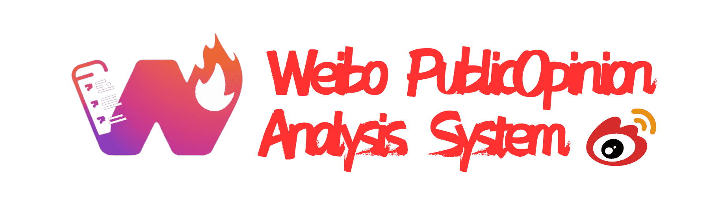
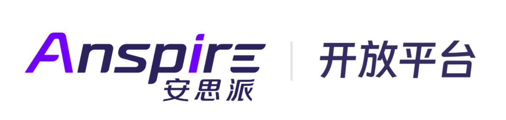
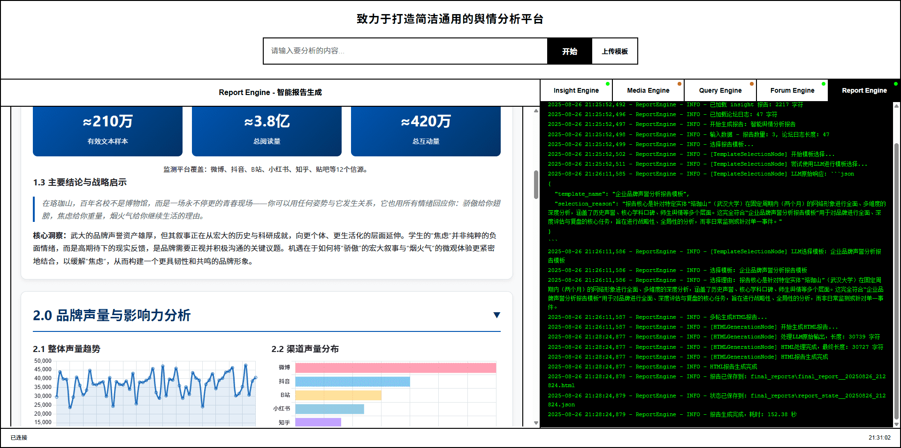
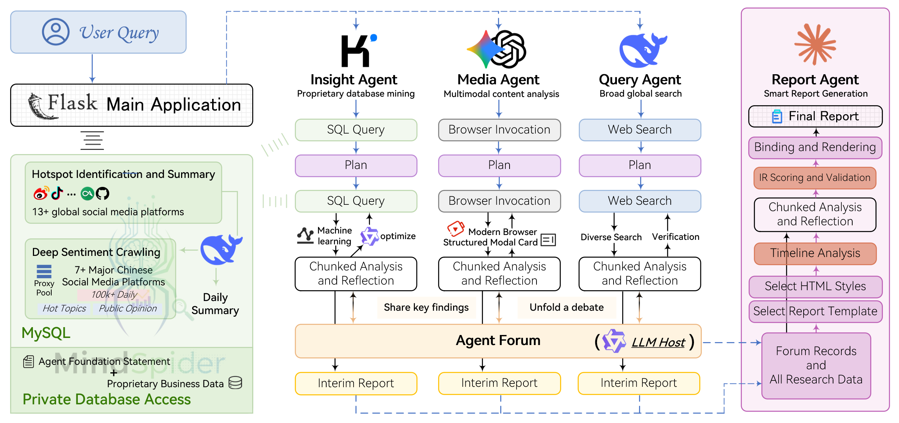
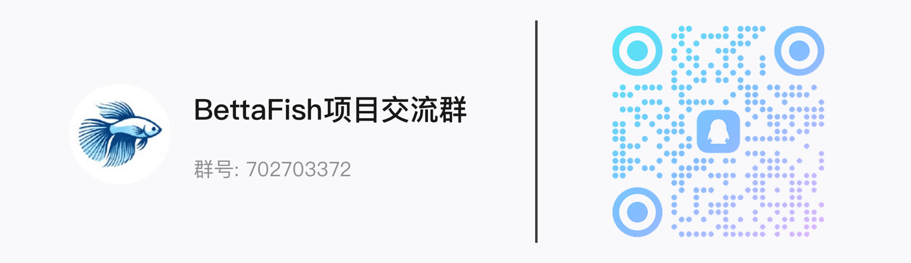

<div align="center">



<a href="https://trendshift.io/repositories/15286" target="_blank"></a>

<a href="https://aihubmix.com/?aff=8Ds9" target="_blank"></a>&ensp;
<a href="https://open.anspire.cn/?share_code=3E1FUOUH" target="_blank"></a>

[](https://github.com/666ghj/BettaFish/stargazers)
[](https://github.com/666ghj/BettaFish/watchers)
[](https://github.com/666ghj/BettaFish/network)
[](https://github.com/666ghj/BettaFish/issues)
[](https://github.com/666ghj/BettaFish/pulls)

[](https://github.com/666ghj/BettaFish/blob/main/LICENSE)
[](https://github.com/666ghj/BettaFish)
[](https://hub.docker.com/)

[English](./README-EN.md) | [中文文档](./README.md) | [한국어](./README-KR.md)

</div>

> [!IMPORTANT]
> 새로 출시된 예측 엔진을 확인하세요: [MiroFish - 만물을 예측하는 간결하고 범용적인 군집 지능 엔진](https://github.com/666ghj/MiroFish)
>
> 
>
> "데이터 분석 3단계"가 완전히 연결되었습니다: MiroFish의 공식 출시를 발표하게 되어 기쁩니다! 마지막 퍼즐 조각이 맞춰지면서 BettaFish(데이터 수집 및 분석)에서 MiroFish(전방위 예측)까지 완전한 파이프라인을 구축했습니다. 원시 데이터에서 지능형 의사결정까지의 폐쇄 루프가 완성되어 미래를 예견하는 것이 가능해졌습니다!

## ⚡ 프로젝트 개요

**"BettaFish"** 는 처음부터 구축된 혁신적인 다중 에이전트 여론 분석 시스템입니다. 정보 편향을 극복하고 실제 여론을 복원하며, 미래 트렌드를 예측하고 의사결정을 지원합니다. 사용자는 채팅하듯 분석 요구사항을 입력하기만 하면, 에이전트가 국내외 30개 이상의 주요 소셜 플랫폼과 수백만 건의 공개 댓글을 자동으로 분석합니다.

> Betta(베타피시)는 작지만 호전적이고 아름다운 물고기로, "작지만 강하고 도전을 두려워하지 않는다"는 의미를 상징합니다.

"武汉大学 여론"을 주제로 시스템이 생성한 연구 보고서 예시: [武汉大学 브랜드 평판 심층 분석 보고서](./final_reports/final_report__20250827_131630.html)

"武汉大学 여론"을 주제로 한 완전한 시스템 실행 영상: [영상 - 武汉大学 브랜드 평판 심층 분석 보고서](https://www.bilibili.com/video/BV1TH1WBxEWN/?vd_source=da3512187e242ce17dceee4c537ec7a6#reply279744466833)

보고서 품질을 넘어, 유사 제품 대비 🚀 여섯 가지 주요 강점을 보유하고 있습니다:

1. **AI 기반 전방위 모니터링**: AI 크롤러 클러스터가 24시간 365일 쉬지 않고 가동되며, 微博(웨이보), 小红书(샤오홍슈), TikTok, 快手(콰이쇼우) 등 국내외 10개 이상의 주요 소셜 미디어 플랫폼을 포괄적으로 커버합니다. 트렌드 콘텐츠를 실시간으로 포착할 뿐 아니라 방대한 사용자 댓글까지 심층 분석하여 가장 진실하고 광범위한 대중의 목소리를 전달합니다.

2. **LLM을 뛰어넘는 복합 분석 엔진**: 5가지 전문 설계 에이전트에만 의존하지 않고, 파인튜닝 모델과 통계 모델 등 미들웨어를 통합합니다. 다중 모델 협업을 통해 분석 결과의 깊이, 정확도, 다차원적 관점을 보장합니다.

3. **강력한 멀티모달 기능**: 텍스트와 이미지의 한계를 뛰어넘어 TikTok, 快手 등의 단편 영상 콘텐츠를 심층 분석하고, 현대 검색 엔진에서 날씨, 캘린더, 주식 등 구조화된 멀티모달 정보 카드를 정밀하게 추출하여 여론 동향을 종합적으로 파악할 수 있습니다.

4. **에이전트 "포럼" 협업 메커니즘**: 각 에이전트에 고유한 도구 세트와 사고 패턴을 부여하고, 토론 사회자 모델을 도입하여 "포럼" 메커니즘을 통해 연쇄적 사고 충돌과 토론을 진행합니다. 이는 단일 모델의 사고적 한계와 소통으로 인한 동질화를 방지할 뿐 아니라, 더 높은 품질의 집단 지성과 의사결정 지원을 촉진합니다.

5. **공개·비공개 데이터의 원활한 통합**: 플랫폼은 공개 여론 분석에 그치지 않고, 내부 비즈니스 데이터베이스와 여론 데이터를 원활하게 통합할 수 있는 고보안 인터페이스를 제공합니다. 데이터 장벽을 허물고 수직적 비즈니스에 "외부 트렌드 + 내부 인사이트"라는 강력한 분석 역량을 제공합니다.

6. **경량화 및 고확장성 프레임워크**: 순수 Python 모듈식 설계를 기반으로 경량화된 원클릭 배포를 실현합니다. 명확한 코드 구조를 통해 개발자가 커스텀 모델과 비즈니스 로직을 쉽게 통합하고, 플랫폼을 빠르게 확장 및 심층 커스터마이징할 수 있습니다.

**여론에서 시작하지만, 여론에 그치지 않습니다**. BettaFish의 목표는 모든 비즈니스 시나리오를 구동하는 간결하고 범용적인 데이터 분석 엔진이 되는 것입니다.

> 예시: 에이전트 도구 세트의 API 파라미터와 프롬프트만 간단히 수정하면 금융 시장 분석 시스템으로 변환할 수 있습니다.
>
> 활발한 Linux.do 프로젝트 토론 스레드: https://linux.do/t/topic/1009280
>
> Linux.do 사용자 비교 리뷰 확인: [오픈소스 프로젝트 (BettaFish) vs manus|minimax|ChatGPT 비교](https://linux.do/t/topic/1148040)

<div align="center">


전통적인 데이터 대시보드와 작별하세요. BettaFish에서는 모든 것이 하나의 간단한 질문에서 시작됩니다. 대화하듯 분석 요구사항을 입력하기만 하면 됩니다.
</div>

## 🪄 스폰서

LLM 모델 API 스폰서: <a href="https://aihubmix.com/?aff=8Ds9" target="_blank"></a>

<details>
<summary>AI 웹 검색, 파일 파싱, 웹 콘텐츠 스크래핑 등 에이전트 핵심 기능 제공업체: <span style="margin-left: 10px"><a href="https://open.anspire.cn/?share_code=3E1FUOUH" target="_blank"></a></span></summary>
Anspire Open은 에이전트 시대를 위한 선도적인 인프라 제공업체입니다. 강력한 에이전트 구축에 필요한 핵심 기능 스택을 개발자에게 제공합니다. 현재 AI 웹 검색(다양한 버전, 경쟁력 있는 가격), 파일 파싱(한시적 무료), 웹 콘텐츠 스크래핑(한시적 무료), 클라우드 브라우저 자동화(Anspire Browser Agent, 베타), 다중 회전 재작성 등의 서비스를 제공합니다. Dify, Coze, 元器 등 주요 에이전트 플랫폼과 원활하게 통합됩니다. 투명한 크레딧 기반 과금 체계와 모듈식 설계를 통해 기업에 효율적이고 저비용의 맞춤형 지원을 제공합니다.
</details>

## 🏗️ 시스템 아키텍처

### 전체 아키텍처 다이어그램

**Insight Agent** 프라이빗 데이터베이스 마이닝: 비공개 여론 데이터베이스 심층 분석 AI 에이전트

**Media Agent** 멀티모달 콘텐츠 분석: 강력한 멀티모달 기능을 갖춘 AI 에이전트

**Query Agent** 정밀 정보 검색: 국내외 웹 검색 기능을 갖춘 AI 에이전트

**Report Agent** 지능형 보고서 생성: 내장 템플릿을 갖춘 다중 라운드 보고서 생성 AI 에이전트

<div align="center">

</div>

### 완전한 분석 워크플로우

| 단계 | 단계명 | 주요 작업 | 참여 컴포넌트 | 반복 특성 |
|------|--------|-----------|--------------|-----------|
| 1 | 사용자 쿼리 | Flask 메인 애플리케이션이 쿼리를 수신 | Flask 메인 애플리케이션 | - |
| 2 | 병렬 시작 | 세 에이전트가 동시에 작업 시작 | Query Agent, Media Agent, Insight Agent | - |
| 3 | 예비 분석 | 각 에이전트가 전용 도구로 개요 검색 수행 | 각 에이전트 + 전용 도구 세트 | - |
| 4 | 전략 수립 | 예비 결과를 바탕으로 세분화된 연구 전략 수립 | 각 에이전트의 내부 의사결정 모듈 | - |
| 5-N | **반복 단계** | **포럼 협업 + 심층 연구** | **ForumEngine + 모든 에이전트** | **다중 라운드 반복** |
| 5.1 | 심층 연구 | 각 에이전트가 포럼 사회자의 안내에 따라 전문 검색 수행 | 각 에이전트 + 반성 메커니즘 + 포럼 안내 | 각 라운드 |
| 5.2 | 포럼 협업 | ForumEngine이 에이전트 발언을 모니터링하고 사회자 안내 생성 | ForumEngine + LLM 사회자 | 각 라운드 |
| 5.3 | 소통 통합 | 각 에이전트가 토론을 바탕으로 연구 방향 조정 | 각 에이전트 + forum_reader 도구 | 각 라운드 |
| N+1 | 결과 통합 | Report Agent가 모든 분석 결과와 포럼 내용을 수집 | Report Agent | - |
| N+2 | IR 중간 표현 | 템플릿과 스타일을 동적으로 선택하고 다중 라운드로 메타데이터 생성 후 IR 중간 표현으로 조합 | Report Agent + 템플릿 엔진 | - |
| N+3 | 보고서 생성 | 청크 단위 품질 검사 수행 후 IR 기반으로 인터랙티브 HTML 보고서 렌더링 | Report Agent + 스티칭 엔진 | - |

### 프로젝트 코드 구조 트리

```
BettaFish/
├── QueryEngine/                            # 국내외 뉴스 광범위 검색 에이전트
│   ├── agent.py                            # 에이전트 메인 로직, 검색 및 분석 워크플로우 조율
│   ├── llms/                               # LLM 인터페이스 래퍼
│   ├── nodes/                              # 처리 노드: 검색, 포맷팅, 요약 등
│   ├── tools/                              # 국내외 뉴스 검색 도구 세트
│   ├── utils/                              # 유틸리티 함수
│   ├── state/                              # 상태 관리
│   ├── prompts/                            # 프롬프트 템플릿
│   └── ...
├── MediaEngine/                            # 강력한 멀티모달 이해 에이전트
│   ├── agent.py                            # 에이전트 메인 로직, 영상/이미지 멀티모달 콘텐츠 처리
│   ├── llms/                               # LLM 인터페이스 래퍼
│   ├── nodes/                              # 처리 노드: 검색, 포맷팅, 요약 등
│   ├── tools/                              # 멀티모달 검색 도구 세트
│   ├── utils/                              # 유틸리티 함수
│   ├── state/                              # 상태 관리
│   ├── prompts/                            # 프롬프트 템플릿
│   └── ...
├── InsightEngine/                          # 프라이빗 데이터베이스 마이닝 에이전트
│   ├── agent.py                            # 에이전트 메인 로직, 데이터베이스 쿼리 및 분석 조율
│   ├── llms/                               # LLM 인터페이스 래퍼
│   │   └── base.py                         # 통합 OpenAI 호환 클라이언트
│   ├── nodes/                              # 처리 노드: 검색, 포맷팅, 요약 등
│   │   ├── base_node.py                    # 기본 노드 클래스
│   │   ├── search_node.py                  # 검색 노드
│   │   ├── formatting_node.py              # 포맷팅 노드
│   │   ├── report_structure_node.py        # 보고서 구조 노드
│   │   └── summary_node.py                 # 요약 노드
│   ├── tools/                              # 데이터베이스 쿼리 및 분석 도구 세트
│   │   ├── keyword_optimizer.py            # Qwen 키워드 최적화 미들웨어
│   │   ├── search.py                       # 데이터베이스 작업 도구 세트 (주제 검색, 댓글 조회 등)
│   │   └── sentiment_analyzer.py           # 감성 분석 통합 도구
│   ├── utils/                              # 유틸리티 함수
│   │   ├── config.py                       # 설정 관리
│   │   ├── db.py                           # SQLAlchemy 비동기 엔진 + 읽기 전용 쿼리 래퍼
│   │   └── text_processing.py              # 텍스트 처리 유틸리티
│   ├── state/                              # 상태 관리
│   │   └── state.py                        # 에이전트 상태 정의
│   ├── prompts/                            # 프롬프트 템플릿
│   │   └── prompts.py                      # 각종 프롬프트 템플릿
│   └── __init__.py
├── ReportEngine/                           # 다중 라운드 보고서 생성 에이전트
│   ├── agent.py                            # 마스터 오케스트레이터: 템플릿 선택 → 레이아웃 → 예산 → 챕터 → 렌더링
│   ├── flask_interface.py                  # Flask/SSE 진입점, 작업 큐 및 스트리밍 이벤트 관리
│   ├── llms/                               # OpenAI 호환 LLM 래퍼
│   │   └── base.py                         # 통합 스트리밍/재시도 클라이언트
│   ├── core/                               # 핵심 기능: 템플릿 파싱, 챕터 저장, 문서 스티칭
│   │   ├── template_parser.py              # Markdown 템플릿 슬라이서 및 슬러그 생성기
│   │   ├── chapter_storage.py              # 챕터 실행 디렉토리, 매니페스트, 원시 스트림 기록기
│   │   └── stitcher.py                     # 문서 IR 스티처, 앵커/메타데이터 추가
│   ├── ir/                                 # 보고서 중간 표현(IR) 계약 및 검증
│   │   ├── schema.py                       # 블록/마크 스키마 상수 정의
│   │   └── validator.py                    # 챕터 JSON 구조 검증기
│   ├── nodes/                              # 전체 워크플로우 추론 노드
│   │   ├── base_node.py                    # 노드 기본 클래스 + 로깅/상태 훅
│   │   ├── template_selection_node.py      # 템플릿 후보 수집 및 LLM 선택
│   │   ├── document_layout_node.py         # 제목/목차/테마 디자이너
│   │   ├── word_budget_node.py             # 단어 예산 계획 및 챕터 지시 생성
│   │   └── chapter_generation_node.py      # 챕터 수준 JSON 생성 + 검증
│   ├── prompts/                            # 프롬프트 라이브러리 및 스키마 설명
│   │   └── prompts.py                      # 템플릿 선택/레이아웃/예산/챕터 프롬프트
│   ├── renderers/                          # IR 렌더러
│   │   ├── html_renderer.py                # 문서 IR → 인터랙티브 HTML
│   │   ├── pdf_renderer.py                 # HTML → PDF 내보내기 (WeasyPrint)
│   │   ├── pdf_layout_optimizer.py         # PDF 레이아웃 최적화기
│   │   └── chart_to_svg.py                 # 차트를 SVG로 변환하는 도구
│   ├── state/                              # 작업/메타데이터 상태 모델
│   │   └── state.py                        # ReportState 및 직렬화 유틸리티
│   ├── utils/                              # 설정 및 헬퍼 유틸리티
│   │   ├── config.py                       # Pydantic 설정 + 프린터 헬퍼
│   │   ├── dependency_check.py             # 의존성 검사 도구
│   │   ├── json_parser.py                  # JSON 파싱 유틸리티
│   │   ├── chart_validator.py              # 차트 검증 도구
│   │   └── chart_repair_api.py             # 차트 수정 API
│   ├── report_template/                    # Markdown 템플릿 라이브러리
│   │   ├── 企业品牌声誉分析报告.md
│   │   └── ...
│   └── __init__.py
├── ForumEngine/                            # 포럼 엔진: 에이전트 협업 메커니즘
│   ├── monitor.py                          # 로그 모니터링 및 포럼 관리 핵심
│   ├── llm_host.py                         # 포럼 사회자 LLM 모듈
│   └── __init__.py
├── MindSpider/                             # 소셜 미디어 크롤러 시스템
│   ├── main.py                             # 크롤러 메인 프로그램 진입점
│   ├── config.py                           # 크롤러 설정 파일
│   ├── BroadTopicExtraction/               # 주제 추출 모듈
│   │   ├── main.py                         # 주제 추출 메인 프로그램
│   │   ├── database_manager.py             # 데이터베이스 관리자
│   │   ├── get_today_news.py               # 오늘의 뉴스 수집기
│   │   └── topic_extractor.py              # 주제 추출기
│   ├── DeepSentimentCrawling/              # 심층 감성 크롤링 모듈
│   │   ├── main.py                         # 심층 크롤링 메인 프로그램
│   │   ├── keyword_manager.py              # 키워드 관리자
│   │   ├── platform_crawler.py             # 플랫폼 크롤러 관리자
│   │   └── MediaCrawler/                   # 미디어 크롤러 핵심
│   │       ├── main.py
│   │       ├── config/                     # 플랫폼별 설정
│   │       ├── media_platform/             # 플랫폼별 크롤러 구현
│   │       └── ...
│   └── schema/                             # 데이터베이스 스키마 정의
│       ├── db_manager.py                   # 데이터베이스 관리자
│       ├── init_database.py                # 데이터베이스 초기화 스크립트
│       ├── mindspider_tables.sql           # 데이터베이스 테이블 구조 SQL
│       ├── models_bigdata.py               # 대규모 미디어 여론 테이블의 SQLAlchemy 매핑
│       └── models_sa.py                    # DailyTopic/Task 확장 테이블 ORM 모델
├── SentimentAnalysisModel/                 # 감성 분석 모델 컬렉션
│   ├── WeiboSentiment_Finetuned/           # 파인튜닝된 BERT/GPT-2 모델
│   │   ├── BertChinese-Lora/               # BERT 중국어 LoRA 파인튜닝
│   │   │   ├── train.py
│   │   │   ├── predict.py
│   │   │   └── ...
│   │   └── GPT2-Lora/                      # GPT-2 LoRA 파인튜닝
│   │       ├── train.py
│   │       ├── predict.py
│   │       └── ...
│   ├── WeiboMultilingualSentiment/         # 다국어 감성 분석
│   │   ├── train.py
│   │   ├── predict.py
│   │   └── ...
│   ├── WeiboSentiment_SmallQwen/           # 소형 파라미터 Qwen3 파인튜닝
│   │   ├── train.py
│   │   ├── predict_universal.py
│   │   └── ...
│   └── WeiboSentiment_MachineLearning/     # 전통적인 머신러닝 방법
│       ├── train.py
│       ├── predict.py
│       └── ...
├── SingleEngineApp/                        # 개별 에이전트 Streamlit 애플리케이션
│   ├── query_engine_streamlit_app.py       # QueryEngine 독립 실행형 앱
│   ├── media_engine_streamlit_app.py       # MediaEngine 독립 실행형 앱
│   └── insight_engine_streamlit_app.py     # InsightEngine 독립 실행형 앱
├── query_engine_streamlit_reports/         # QueryEngine 독립 실행형 앱 출력
├── media_engine_streamlit_reports/         # MediaEngine 독립 실행형 앱 출력
├── insight_engine_streamlit_reports/       # InsightEngine 독립 실행형 앱 출력
├── templates/                              # Flask 프론트엔드 템플릿
│   └── index.html                          # 메인 인터페이스 HTML
├── static/                                 # 정적 리소스
│   ├── image/                              # 이미지 리소스
│   │   └── ...
│   ├── Partial README for PDF Exporting/   # PDF 내보내기 의존성 설정 가이드
│   └── v2_report_example/                  # 보고서 렌더링 예시
│       └── report_all_blocks_demo/         # 전체 블록 유형 데모 (HTML/PDF/MD)
├── logs/                                   # 런타임 로그 디렉토리
├── final_reports/                          # 최종 생성된 보고서 파일
│   ├── ir/                                 # 보고서 IR JSON 파일
│   └── *.html                              # 최종 HTML 보고서
├── utils/                                  # 공통 유틸리티 함수
│   ├── forum_reader.py                     # 에이전트 간 포럼 통신 도구
│   ├── github_issues.py                    # 통합 GitHub 이슈 링크 생성기 및 오류 포맷터
│   └── retry_helper.py                     # 네트워크 요청 재시도 메커니즘 유틸리티
├── tests/                                  # 단위 테스트 및 통합 테스트
│   ├── run_tests.py                        # pytest 진입 스크립트
│   ├── test_monitor.py                     # ForumEngine 모니터링 단위 테스트
│   ├── test_report_engine_sanitization.py  # ReportEngine 보안 테스트
│   └── ...
├── app.py                                  # Flask 메인 애플리케이션 진입점
├── config.py                               # 전역 설정 파일
├── .env.example                            # 환경 변수 예시 파일
├── docker-compose.yml                      # Docker 멀티 서비스 오케스트레이션 설정
├── Dockerfile                              # Docker 이미지 빌드 파일
├── requirements.txt                        # Python 의존성 목록
├── regenerate_latest_html.py               # 최신 챕터를 재조합하여 HTML 렌더링
├── regenerate_latest_md.py                 # 최신 챕터를 재조합하여 Markdown 렌더링
├── regenerate_latest_pdf.py                # PDF 재생성 유틸리티 스크립트
├── report_engine_only.py                   # Report Engine CLI 버전
├── README.md                               # 중국어 문서
├── README-EN.md                            # 영어 문서
├── README-KR.md                            # 한국어 문서
├── CONTRIBUTING.md                         # 중국어 기여 가이드
├── CONTRIBUTING-EN.md                      # 영어 기여 가이드
└── LICENSE                                 # GPL-2.0 오픈소스 라이선스
```

## 🚀 빠른 시작 (Docker)

### 1. 프로젝트 시작

`.env.example` 파일을 복사하여 `.env`로 이름을 변경하고, 필요에 따라 `.env` 파일의 환경 변수를 설정합니다.

다음 명령어를 실행하여 모든 서비스를 **백그라운드**에서 시작합니다:

```bash
docker compose up -d
```

> **참고: 이미지 다운로드 속도가 느릴 수 있습니다.** 원본 `docker-compose.yml` 파일에는 대체 미러 이미지 주소가 **주석**으로 제공되어 있으니 교체하여 사용하세요.

### 2. 설정 안내

#### 데이터베이스 설정 (PostgreSQL)

아래 파라미터로 데이터베이스 연결 정보를 설정합니다. MySQL도 지원하므로 필요에 따라 조정할 수 있습니다:

| 설정 항목 | 입력값 | 설명 |
| :--- | :--- | :--- |
| `DB_HOST` | `db` | 데이터베이스 서비스명 (`docker-compose.yml`에 정의된 서비스명) |
| `DB_PORT` | `5432` | 기본 PostgreSQL 포트 |
| `DB_USER` | `bettafish` | 데이터베이스 사용자명 |
| `DB_PASSWORD` | `bettafish` | 데이터베이스 비밀번호 |
| `DB_NAME` | `bettafish` | 데이터베이스 이름 |
| **기타** | **기본값 유지** | 데이터베이스 연결 풀 등 기타 파라미터는 기본값을 유지하세요. |

#### 대형 언어 모델(LLM) 설정

> 모든 LLM 호출은 OpenAI API 인터페이스 표준을 사용합니다.

데이터베이스 설정 완료 후, 시스템이 선택한 LLM 서비스에 연결될 수 있도록 **모든 LLM 관련 파라미터**를 설정합니다.

위의 모든 설정을 완료하고 저장하면 시스템이 정상적으로 실행됩니다.

## 🔧 소스 코드 실행 가이드

> 에이전트 시스템 구축이 처음이라면 매우 간단한 데모부터 시작하세요: [Deep Search Agent Demo](https://github.com/666ghj/DeepSearchAgent-Demo)

### 시스템 요구사항

- **운영체제**: Windows, Linux, MacOS
- **Python 버전**: 3.9+
- **Conda**: Anaconda 또는 Miniconda
- **데이터베이스**: PostgreSQL(권장) 또는 MySQL
- **메모리**: 2GB 이상 권장

### 1. 환경 생성

#### Conda 사용 시

```bash
# conda 환경 생성
conda create -n your_conda_name python=3.11
conda activate your_conda_name
```

#### uv 사용 시

```bash
# uv 환경 생성
uv venv --python 3.11 # Python 3.11 환경 생성
```

### 2. PDF 내보내기 시스템 의존성 설치 (선택 사항)

자세한 설정 안내: [의존성 설정하기](./static/Partial%20README%20for%20PDF%20Exporting/README.md)

### 3. 의존성 패키지 설치

> 2단계를 건너뛰면 WeasyPrint 라이브러리가 올바르게 설치되지 않아 PDF 기능을 사용할 수 없을 수 있습니다.

```bash
# 기본 의존성 설치
pip install -r requirements.txt

# uv 버전 명령어 (더 빠른 설치)
uv pip install -r requirements.txt
# 로컬 감성 분석 모델을 사용하지 않으려면 (계산 요구사항이 적고 기본적으로 CPU 버전 설치),
# 해당 파일의 '머신러닝' 섹션을 주석 처리한 후 명령어를 실행하세요.
```

### 4. Playwright 브라우저 드라이버 설치

```bash
# 브라우저 드라이버 설치 (크롤러 기능용)
playwright install chromium
```

### 5. LLM 및 데이터베이스 설정

프로젝트 루트 디렉토리의 `.env.example` 파일을 복사하여 `.env`로 이름을 변경합니다.

`.env` 파일을 편집하여 API 키를 입력합니다 (자체 모델 및 검색 프록시 선택도 가능합니다. 프로젝트 루트 디렉토리의 `.env.example` 또는 `config.py` 참조):

```yml
# ====================== 데이터베이스 설정 ======================
# 데이터베이스 호스트, 예: localhost 또는 127.0.0.1
DB_HOST=your_db_host
# 데이터베이스 포트 번호, 기본값은 3306
DB_PORT=3306
# 데이터베이스 사용자명
DB_USER=your_db_user
# 데이터베이스 비밀번호
DB_PASSWORD=your_db_password
# 데이터베이스 이름
DB_NAME=your_db_name
# 데이터베이스 문자셋, 이모지 호환을 위해 utf8mb4 권장
DB_CHARSET=utf8mb4
# 데이터베이스 유형: postgresql 또는 mysql
DB_DIALECT=postgresql
# 데이터베이스 초기화 불필요, app.py 실행 시 자동으로 확인됨

# ====================== LLM 설정 ======================
# OpenAI 호환 요청 형식을 따르는 한 각 Engine의 LLM 제공업체를 변경할 수 있습니다.
# 설정 파일은 각 에이전트에 권장 LLM을 제공합니다. 초기 배포 시 권장 설정을 먼저 참고하세요.

# Insight Agent
INSIGHT_ENGINE_API_KEY=
INSIGHT_ENGINE_BASE_URL=
INSIGHT_ENGINE_MODEL_NAME=

# Media Agent
...
```

### 6. 시스템 실행

#### 6.1 전체 시스템 실행 (권장)

```bash
# 프로젝트 루트 디렉토리에서 conda 환경 활성화
conda activate your_conda_name

# 메인 애플리케이션 시작
python app.py
```

uv 버전 실행 명령어:
```bash
# 프로젝트 루트 디렉토리에서 uv 환경 활성화
.venv\Scripts\activate

# 메인 애플리케이션 시작
python app.py
```

> 참고1: 실행 종료 후 Streamlit 앱이 정상적으로 종료되지 않아 포트를 계속 점유할 수 있습니다. 이 경우 해당 포트를 사용하는 프로세스를 찾아 종료하세요.

> 참고2: 데이터 수집은 별도로 수행해야 합니다. 6.3 가이드를 참조하세요.

http://localhost:5000 에 접속하여 전체 시스템을 사용할 수 있습니다.

#### 6.2 개별 에이전트 실행

```bash
# QueryEngine 시작
streamlit run SingleEngineApp/query_engine_streamlit_app.py --server.port 8503

# MediaEngine 시작
streamlit run SingleEngineApp/media_engine_streamlit_app.py --server.port 8502

# InsightEngine 시작
streamlit run SingleEngineApp/insight_engine_streamlit_app.py --server.port 8501
```

#### 6.3 크롤러 시스템 독립 실행

자세한 설정 문서: [MindSpider 사용 가이드](./MindSpider/README.md)

<div align="center">


MindSpider 실행 예시
</div>

```bash
# 크롤러 디렉토리로 이동
cd MindSpider

# 프로젝트 초기화
python main.py --setup

# 주제 추출 실행 (인기 뉴스 및 키워드 수집)
python main.py --broad-topic

# 완전한 크롤러 워크플로우 실행
python main.py --complete --date 2024-01-20

# 주제 추출만 실행
python main.py --broad-topic --date 2024-01-20

# 심층 크롤링만 실행
python main.py --deep-sentiment --platforms xhs dy wb
```

#### 6.4 커맨드라인 보고서 생성 도구

이 도구는 세 분석 엔진의 실행 단계를 건너뛰고 최신 로그 파일을 직접 로드하여 Web 인터페이스 없이 종합 보고서를 생성합니다(점진적 파일 검증 단계도 생략). 기본적으로 PDF 이후 Markdown 파일도 함께 생성합니다(CLI 플래그로 비활성화 가능). 보고서 출력 결과가 만족스럽지 않아 빠른 재시도가 필요하거나 Report Engine 디버깅 시 주로 사용합니다.

```bash
# 기본 사용 (파일명에서 주제 자동 추출)
python report_engine_only.py

# 보고서 주제 지정
python report_engine_only.py --query "토목공학 산업 분석"

# PDF 생성 건너뛰기 (시스템이 지원하더라도)
python report_engine_only.py --skip-pdf

# Markdown 생성 건너뛰기
python report_engine_only.py --skip-markdown

# 상세 로깅 표시
python report_engine_only.py --verbose

# 도움말 정보 표시
python report_engine_only.py --help
```

**기능 설명:**

1. **자동 의존성 검사**: PDF 생성에 필요한 시스템 의존성을 자동으로 확인하고 누락된 경우 설치 안내를 제공합니다.
2. **최신 파일 가져오기**: 세 엔진 디렉토리(`insight_engine_streamlit_reports`, `media_engine_streamlit_reports`, `query_engine_streamlit_reports`)에서 최신 분석 보고서를 자동으로 가져옵니다.
3. **파일 확인**: 선택된 모든 파일명, 경로, 수정 시간을 표시하고 사용자 확인을 기다립니다 (기본값 `y` 입력 시 계속, `n` 입력 시 종료).
4. **직접 보고서 생성**: 파일 추가 검증을 건너뛰고 Report Engine을 직접 호출하여 종합 보고서를 생성합니다.
5. **자동 파일 저장**:
   - HTML 보고서는 `final_reports/` 디렉토리에 저장
   - PDF 보고서(의존성이 있는 경우)는 `final_reports/pdf/` 디렉토리에 저장
   - Markdown 보고서(`--skip-markdown`으로 비활성화 가능)는 `final_reports/md/` 디렉토리에 저장
   - 파일명 형식: `final_report_{주제}_{타임스탬프}.html/pdf/md`

**주의사항:**

- 세 엔진 디렉토리 중 하나 이상에 `.md` 보고서 파일이 있어야 합니다.
- 커맨드라인 도구는 Web 인터페이스와 독립적으로 작동하며 서로 간섭하지 않습니다.
- PDF 생성에는 시스템 의존성이 필요합니다. 위의 "PDF 내보내기 시스템 의존성 설치" 섹션을 참조하세요.

**최신 결과 빠른 재렌더링:**

- `regenerate_latest_html.py` / `regenerate_latest_md.py`: `CHAPTER_OUTPUT_DIR`에서 최신 챕터 JSON을 Document IR로 재조합하여 HTML 또는 Markdown으로 직접 렌더링합니다.
- `regenerate_latest_pdf.py`: `final_reports/ir`에서 최신 IR을 읽어 SVG 벡터 차트로 PDF를 재내보냅니다.

## ⚙️ 고급 설정 (더 이상 사용되지 않음: 설정이 프로젝트 루트 디렉토리의 `.env` 파일로 통합되었으며, 다른 하위 에이전트는 루트 설정을 자동으로 상속받습니다)

### 핵심 파라미터 수정

#### 에이전트 설정 파라미터

각 에이전트에는 필요에 따라 조정할 수 있는 전용 설정 파일이 있습니다:

```python
# QueryEngine/utils/config.py
class Config:
    max_reflections = 2           # 반성 라운드 수
    max_search_results = 15       # 최대 검색 결과 수
    max_content_length = 8000     # 최대 콘텐츠 길이

# MediaEngine/utils/config.py
class Config:
    comprehensive_search_limit = 10  # 종합 검색 제한
    web_search_limit = 15           # 웹 검색 제한

# InsightEngine/utils/config.py
class Config:
    default_search_topic_globally_limit = 200    # 전역 검색 제한
    default_get_comments_limit = 500             # 댓글 조회 제한
    max_search_results_for_llm = 50              # LLM에 전달하는 최대 결과 수
```

#### 감성 분석 모델 설정

```python
# InsightEngine/tools/sentiment_analyzer.py
SENTIMENT_CONFIG = {
    'model_type': 'multilingual',     # 옵션: 'bert', 'multilingual', 'qwen'
    'confidence_threshold': 0.8,      # 신뢰도 임계값
    'batch_size': 32,                 # 배치 크기
    'max_sequence_length': 512,       # 최대 시퀀스 길이
}
```

### 다양한 LLM 모델 통합

시스템은 OpenAI 요청 형식을 따르는 모든 LLM 제공업체를 지원합니다. `config.py`에 KEY, BASE_URL, MODEL_NAME만 입력하면 됩니다.

> OpenAI 요청 형식이란? 간단한 예시를 제공합니다:
>```python
>from openai import OpenAI
>
>client = OpenAI(api_key="your_api_key",
>                base_url="https://aihubmix.com/v1")
>
>response = client.chat.completions.create(
>    model="gpt-4o-mini",
>    messages=[
>        {'role': 'user',
>         'content': "추론 모델은 시장에 어떤 새로운 기회를 가져올까요?"}
>    ],
>)
>
>complete_response = response.choices[0].message.content
>print(complete_response)
>```

### 감성 분석 모델 변경

시스템은 여러 감성 분석 방법을 통합하고 있으며, 필요에 따라 선택할 수 있습니다:

#### 1. 다국어 감성 분석

```bash
cd SentimentAnalysisModel/WeiboMultilingualSentiment
python predict.py --text "This product is amazing!" --lang "en"
```

#### 2. 소형 파라미터 Qwen3 파인튜닝

```bash
cd SentimentAnalysisModel/WeiboSentiment_SmallQwen
python predict_universal.py --text "이번 행사는 매우 성공적이었습니다"
```

#### 3. BERT 기반 파인튜닝 모델

```bash
# BERT 중국어 모델 사용
cd SentimentAnalysisModel/WeiboSentiment_Finetuned/BertChinese-Lora
python predict.py --text "이 제품은 정말 훌륭합니다"
```

#### 4. GPT-2 LoRA 파인튜닝 모델

```bash
cd SentimentAnalysisModel/WeiboSentiment_Finetuned/GPT2-Lora
python predict.py --text "오늘은 기분이 좋지 않습니다"
```

#### 5. 전통적인 머신러닝 방법

```bash
cd SentimentAnalysisModel/WeiboSentiment_MachineLearning
python predict.py --model_type "svm" --text "서비스 태도 개선이 필요합니다"
```

### 커스텀 비즈니스 데이터베이스 통합

#### 1. 데이터베이스 연결 설정 수정

```python
# config.py에 비즈니스 데이터베이스 설정 추가
BUSINESS_DB_HOST = "your_business_db_host"
BUSINESS_DB_PORT = 3306
BUSINESS_DB_USER = "your_business_user"
BUSINESS_DB_PASSWORD = "your_business_password"
BUSINESS_DB_NAME = "your_business_database"
```

#### 2. 커스텀 데이터 액세스 도구 생성

```python
# InsightEngine/tools/custom_db_tool.py
class CustomBusinessDBTool:
    """커스텀 비즈니스 데이터베이스 쿼리 도구"""

    def __init__(self):
        self.connection_config = {
            'host': config.BUSINESS_DB_HOST,
            'port': config.BUSINESS_DB_PORT,
            'user': config.BUSINESS_DB_USER,
            'password': config.BUSINESS_DB_PASSWORD,
            'database': config.BUSINESS_DB_NAME,
        }

    def search_business_data(self, query: str, table: str):
        """비즈니스 데이터 쿼리"""
        # 비즈니스 로직 구현
        pass

    def get_customer_feedback(self, product_id: str):
        """고객 피드백 데이터 조회"""
        # 고객 피드백 쿼리 로직 구현
        pass
```

#### 3. InsightEngine에 통합

```python
# InsightEngine/agent.py에 커스텀 도구 통합
from .tools.custom_db_tool import CustomBusinessDBTool

class DeepSearchAgent:
    def __init__(self, config=None):
        # ... 기타 초기화 코드
        self.custom_db_tool = CustomBusinessDBTool()

    def execute_custom_search(self, query: str):
        """커스텀 비즈니스 데이터 검색 실행"""
        return self.custom_db_tool.search_business_data(query, "your_table")
```

### 커스텀 보고서 템플릿

#### 1. Web 인터페이스에서 업로드

시스템은 커스텀 템플릿 파일(.md 또는 .txt 형식) 업로드를 지원하며, 보고서 생성 시 선택하여 사용할 수 있습니다.

#### 2. 템플릿 파일 생성

`ReportEngine/report_template/` 디렉토리에 새 템플릿을 생성하면, 에이전트가 자동으로 가장 적절한 템플릿을 선택합니다.

## 🤝 기여 가이드

모든 형태의 기여를 환영합니다!

**다음 기여 가이드라인을 읽어주세요:**
- [CONTRIBUTING-EN.md](./CONTRIBUTING-EN.md)

## 🦖 다음 개발 계획

시스템이 마지막 예측 단계를 완료했습니다! 【MiroFish - 만물을 예측하다】 방문하기: https://github.com/666ghj/MiroFish

<div align="center">


</div>

## ⚠️ 면책 조항

**중요 고지: 이 프로젝트는 교육, 학술 연구 및 학습 목적으로만 사용됩니다.**

1. **준수 선언**:
   - 이 프로젝트의 모든 코드, 도구 및 기능은 교육, 학술 연구 및 학습 목적으로만 사용됩니다.
   - 상업적 용도나 수익 창출 활동은 엄격히 금지됩니다.
   - 불법적, 비준수적 또는 타인의 권리를 침해하는 모든 활동은 엄격히 금지됩니다.

2. **웹 스크래핑 면책**:
   - 이 프로젝트의 웹 스크래핑 기능은 기술 학습 및 연구 목적으로만 사용됩니다.
   - 사용자는 대상 웹사이트의 robots.txt 프로토콜 및 이용 약관을 준수해야 합니다.
   - 사용자는 관련 법률 및 규정을 준수해야 하며 악의적인 스크래핑이나 데이터 남용을 해서는 안 됩니다.
   - 웹 스크래핑 기능 사용으로 인한 법적 결과는 사용자가 전적으로 책임집니다.

3. **데이터 사용 면책**:
   - 이 프로젝트의 데이터 분석 기능은 학술 연구 목적으로만 사용됩니다.
   - 분석 결과를 상업적 의사결정이나 수익 창출 목적으로 사용하는 것은 엄격히 금지됩니다.
   - 사용자는 분석되는 데이터의 합법성과 규정 준수를 보장해야 합니다.

4. **기술 면책**:
   - 이 프로젝트는 명시적 또는 묵시적 보증 없이 "있는 그대로" 제공됩니다.
   - 저자는 이 프로젝트 사용으로 인한 직접적 또는 간접적 손실에 대해 책임을 지지 않습니다.
   - 사용자는 프로젝트의 적용 가능성과 위험을 독립적으로 평가해야 합니다.

5. **책임 제한**:
   - 사용자는 이 프로젝트를 사용하기 전에 관련 법률 및 규정을 충분히 이해해야 합니다.
   - 사용자는 자신의 사용 행위가 현지 법률 및 규정 요건을 준수하는지 확인해야 합니다.
   - 이 프로젝트의 불법적 사용으로 인한 모든 결과는 사용자가 전적으로 책임집니다.

**이 프로젝트를 사용하기 전에 위의 면책 조항을 주의 깊게 읽고 이해하세요. 이 프로젝트를 사용함으로써 위의 모든 조항에 동의하고 수락한 것으로 간주됩니다.**

## 📄 라이선스

이 프로젝트는 [GPL-2.0 라이선스](LICENSE)에 따라 라이선스가 부여됩니다. 자세한 내용은 LICENSE 파일을 참조하세요.

## 🎉 지원 및 연락처

### 도움 받기

자주 묻는 질문(FAQ): https://github.com/666ghj/BettaFish/issues/185

- **프로젝트 홈페이지**: [GitHub 저장소](https://github.com/666ghj/BettaFish)
- **이슈 보고**: [Issues 페이지](https://github.com/666ghj/BettaFish/issues)
- **기능 요청**: [Discussions 페이지](https://github.com/666ghj/BettaFish/discussions)

### 연락처

- 📧 **이메일**: hangjiang@bupt.edu.cn

### 비즈니스 협력

- **기업 맞춤형 개발**
- **빅데이터 서비스**
- **학술 협력**
- **기술 교육**

## 👥 기여자

뛰어난 기여자들에게 감사드립니다:

[](https://github.com/666ghj/BettaFish/graphs/contributors)

## 🌟 공식 커뮤니티 참여

<div align="center">
  
  
</div>

## 📈 프로젝트 통계

<a href="https://www.star-history.com/#666ghj/BettaFish&type=date&legend=top-left">
 <picture>
   <source media="(prefers-color-scheme: dark)" srcset="https://api.star-history.com/svg?repos=666ghj/BettaFish&type=date&theme=dark&legend=top-left" />
   <source media="(prefers-color-scheme: light)" srcset="https://api.star-history.com/svg?repos=666ghj/BettaFish&type=date&legend=top-left" />
   
 </picture>
</a>


