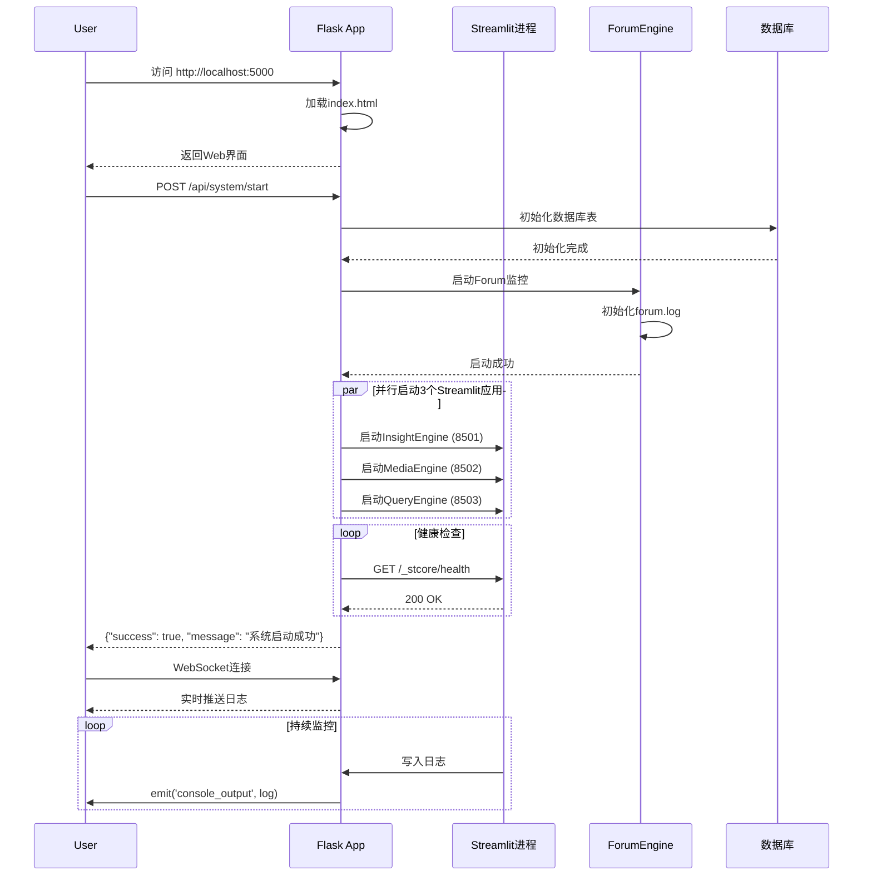
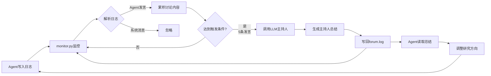
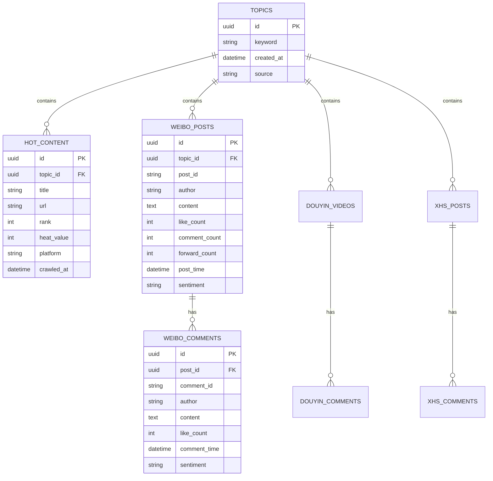
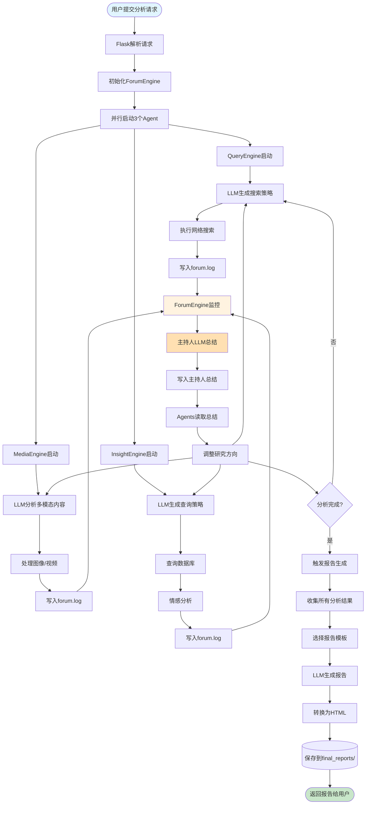
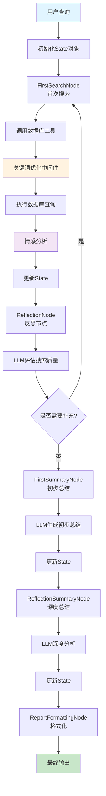

# BettaFish 系统架构设计文档

**文档版本**: 1.0.0
**最后更新**: 2025-11-15
**项目版本**: v1.2.1
**文档性质**: 技术架构说明

---

## 目录

- [架构概览](#架构概览)
- [设计原则](#设计原则)
- [分层架构](#分层架构)
- [核心组件详解](#核心组件详解)
- [数据流设计](#数据流设计)
- [通信机制](#通信机制)
- [扩展性设计](#扩展性设计)
- [性能优化](#性能优化)
- [安全设计](#安全设计)
- [容错与恢复](#容错与恢复)

---

## 架构概览

### 1.1 系统定位

BettaFish采用**多Agent协作架构**,每个Agent专注于特定领域的分析任务,通过ForumEngine实现知识共享与协作决策。

**核心设计理念**:
- **专业化分工**: 每个Agent有独立的工具集和LLM配置
- **水平协作**: Agent间平等交流,无中心化控制
- **异步消息传递**: 基于日志文件的松耦合通信
- **可扩展性**: 易于添加新Agent或工具

### 1.2 总体架构图

```mermaid
graph TB
    subgraph "表现层 Presentation Layer"
        WebUI[Web界面<br/>Flask + Jinja2]
        StreamlitUI[Streamlit控制台<br/>独立Agent UI]
        WebSocket[WebSocket<br/>实时通信]
    end

    subgraph "应用层 Application Layer"
        FlaskApp[Flask主应用<br/>app.py<br/>1060行]
        ConfigMgr[配置管理<br/>Pydantic Settings<br/>config.py]
        ProcessMgr[进程管理<br/>subprocess + threading]
    end

    subgraph "Agent层 Agent Intelligence Layer"
        direction LR

        subgraph "QueryEngine"
            QA[Query Agent<br/>搜索协调器]
            QLM[DeepSeek LLM]
            QTools[Tavily/Bocha<br/>搜索工具]
        end

        subgraph "MediaEngine"
            MA[Media Agent<br/>多模态分析]
            MLM[Gemini LLM<br/>视觉理解]
            MTools[图像/视频<br/>处理工具]
        end

        subgraph "InsightEngine"
            IA[Insight Agent<br/>数据挖掘]
            ILM[Kimi LLM<br/>长文本理解]
            ITools[数据库查询<br/>情感分析]
        end

        subgraph "ReportEngine"
            RA[Report Agent<br/>报告生成]
            RLM[Gemini LLM]
            RTemplates[报告模板库]
        end
    end

    subgraph "协作层 Collaboration Layer"
        Forum[ForumEngine<br/>论坛监控器]
        ForumHost[LLM主持人<br/>Qwen模型]
        ForumLog[forum.log<br/>通信日志]
    end

    subgraph "工具层 Tools & Middleware"
        Spider[MindSpider<br/>爬虫系统<br/>15000行]
        Sentiment[情感分析<br/>5种模型方案]
        KeywordOpt[关键词优化<br/>Qwen3中间件]
        SearchAPI[搜索API<br/>Tavily/Bocha]
    end

    subgraph "数据层 Data Persistence Layer"
        PostgreSQL[(PostgreSQL<br/>主数据库)]
        Redis[(Redis<br/>缓存层<br/>可选)]
        FileSystem[文件系统<br/>logs/reports]
    end

    subgraph "外部接口层 External Services"
        LLMAPIs[LLM API服务<br/>Kimi/Gemini/DeepSeek/Qwen]
        SearchAPIs[搜索API<br/>Tavily/Bocha]
    end

    %% 表现层连接
    WebUI --> FlaskApp
    StreamlitUI --> QA
    StreamlitUI --> MA
    StreamlitUI --> IA
    WebSocket --> FlaskApp

    %% 应用层连接
    FlaskApp --> ConfigMgr
    FlaskApp --> ProcessMgr
    FlaskApp --> QA
    FlaskApp --> MA
    FlaskApp --> IA
    FlaskApp --> RA

    %% Agent内部连接
    QA --> QLM
    QA --> QTools
    MA --> MLM
    MA --> MTools
    IA --> ILM
    IA --> ITools
    RA --> RLM
    RA --> RTemplates

    %% 协作层连接
    QA --> ForumLog
    MA --> ForumLog
    IA --> ForumLog
    Forum --> ForumLog
    Forum --> ForumHost

    %% 工具层连接
    QA --> SearchAPI
    MA --> SearchAPI
    IA --> Spider
    IA --> Sentiment
    IA --> KeywordOpt

    %% 数据层连接
    Spider --> PostgreSQL
    QA --> PostgreSQL
    MA --> PostgreSQL
    IA --> PostgreSQL
    RA --> PostgreSQL
    RA --> FileSystem
    Forum --> FileSystem

    %% 外部接口
    QLM --> LLMAPIs
    MLM --> LLMAPIs
    ILM --> LLMAPIs
    RLM --> LLMAPIs
    ForumHost --> LLMAPIs
    KeywordOpt --> LLMAPIs
    QTools --> SearchAPIs

    classDef agent fill:#e1f5ff,stroke:#01579b,stroke-width:2px
    classDef llm fill:#fff3e0,stroke:#e65100,stroke-width:2px
    classDef data fill:#f3e5f5,stroke:#4a148c,stroke-width:2px

    class QA,MA,IA,RA agent
    class QLM,MLM,ILM,RLM,ForumHost llm
    class PostgreSQL,Redis,FileSystem data
```



---

## 设计原则

### 2.1 SOLID原则应用

#### 2.1.1 单一职责原则 (SRP)

**实现方式**: 每个Agent只负责一个特定领域

```python
# 正例: QueryEngine只负责网络搜索
class QueryAgent:
    def search_web(self, query: str) -> List[SearchResult]:
        """执行网络搜索"""
        pass

# 反例: 不应该让QueryAgent处理数据库
# ❌ def query_database(self, query: str):  # 违反SRP
```

**效果**:
- QueryEngine: 网络搜索专家
- MediaEngine: 多模态内容专家
- InsightEngine: 数据挖掘专家
- ReportEngine: 报告生成专家

#### 2.1.2 开闭原则 (OCP)

**实现方式**: 通过配置系统实现对扩展开放,对修改关闭

```python
# config.py - 通过配置扩展,无需修改代码
class Settings(BaseSettings):
    # 新增Agent只需添加配置,无需修改Agent代码
    NEW_AGENT_API_KEY: Optional[str] = None
    NEW_AGENT_BASE_URL: Optional[str] = None
    NEW_AGENT_MODEL_NAME: str = "default-model"

# 工具扩展示例
class MediaCrawlerDB:
    def __init__(self):
        self.tools = {
            "search_hot_content": self.search_hot_content,
            "search_topic_globally": self.search_topic_globally,
            # 新工具直接注册,无需修改核心逻辑
            "new_tool": self.new_tool_method,
        }
```

#### 2.1.3 里氏替换原则 (LSP)

**实现方式**: 所有Agent继承自通用接口

```python
# 基础Agent协议(虽然Python不强制,但设计遵循)
class BaseAgent(Protocol):
    def execute_search(self, query: str) -> Dict[str, Any]:
        """所有Agent必须实现的搜索方法"""
        ...

# 各Agent可互相替换而不影响系统运行
agents = {
    "query": QueryAgent(),
    "media": MediaAgent(),
    "insight": DeepSearchAgent(),
}

for agent_name, agent in agents.items():
    result = agent.execute_search(user_query)  # 统一接口
```

#### 2.1.4 接口隔离原则 (ISP)

**实现方式**: 每个Agent只暴露必要的接口

```python
# InsightEngine只暴露数据库相关接口
class DeepSearchAgent:
    # 公开接口 - 数据库操作
    def execute_search_tool(self, tool_name: str, query: str, **kwargs) -> DBResponse:
        pass

    def analyze_sentiment_only(self, texts: Union[str, List[str]]) -> Dict:
        pass

    # 私有方法 - 内部实现细节
    def _validate_date_format(self, date_str: str) -> bool:
        pass

    def _perform_sentiment_analysis(self, results: List[Dict]) -> Dict:
        pass
```

#### 2.1.5 依赖倒置原则 (DIP)

**实现方式**: 依赖抽象(配置)而非具体实现

```python
# 高层模块(Agent)依赖抽象(Settings)
class DeepSearchAgent:
    def __init__(self, config: Optional[Settings] = None):
        # 依赖注入配置对象
        self.config = config or settings

        # 基于配置创建依赖
        self.llm_client = self._initialize_llm()

    def _initialize_llm(self) -> LLMClient:
        # 依赖配置而非硬编码
        return LLMClient(
            api_key=self.config.INSIGHT_ENGINE_API_KEY,
            model_name=self.config.INSIGHT_ENGINE_MODEL_NAME,
            base_url=self.config.INSIGHT_ENGINE_BASE_URL,
        )
```

### 2.2 设计模式应用

#### 2.2.1 工厂模式 (Factory Pattern)

**应用场景**: LLM客户端创建

```python
# InsightEngine/llms/base.py
class LLMClient:
    """LLM客户端工厂"""

    def __init__(self, api_key: str, model_name: str, base_url: str = None):
        # 统一的OpenAI兼容接口
        self.client = OpenAI(
            api_key=api_key,
            base_url=base_url or "https://api.openai.com/v1"
        )
        self.model_name = model_name

    @classmethod
    def from_config(cls, config: Settings) -> 'LLMClient':
        """从配置创建客户端"""
        return cls(
            api_key=config.INSIGHT_ENGINE_API_KEY,
            model_name=config.INSIGHT_ENGINE_MODEL_NAME,
            base_url=config.INSIGHT_ENGINE_BASE_URL
        )
```

#### 2.2.2 策略模式 (Strategy Pattern)

**应用场景**: 情感分析模型选择

```python
# SentimentAnalysisModel/ - 5种分析策略
class SentimentAnalyzer(ABC):
    @abstractmethod
    def analyze(self, text: str) -> Dict[str, Any]:
        pass

class MultilingualSentimentAnalyzer(SentimentAnalyzer):
    """多语言情感分析策略"""
    def analyze(self, text: str) -> Dict[str, Any]:
        # 使用mBERT模型
        pass

class QwenSentimentAnalyzer(SentimentAnalyzer):
    """Qwen微调模型策略"""
    def analyze(self, text: str) -> Dict[str, Any]:
        # 使用Qwen3模型
        pass

# 运行时选择策略
analyzer = MultilingualSentimentAnalyzer()  # 或其他策略
result = analyzer.analyze(user_text)
```

#### 2.2.3 观察者模式 (Observer Pattern)

**应用场景**: ForumEngine日志监控

```python
# ForumEngine/monitor.py
class ForumMonitor:
    """日志观察者"""

    def __init__(self):
        self.observers = []  # WebSocket客户端列表
        self.log_file = "logs/forum.log"

    def register_observer(self, observer):
        """注册观察者(WebSocket连接)"""
        self.observers.append(observer)

    def notify_observers(self, message: dict):
        """通知所有观察者"""
        for observer in self.observers:
            observer.emit('forum_message', message)

    def monitor_log_changes(self):
        """监控日志变化并通知"""
        while True:
            new_lines = self._read_new_log_lines()
            for line in new_lines:
                message = self._parse_log_line(line)
                if message:
                    self.notify_observers(message)  # 通知
```

#### 2.2.4 责任链模式 (Chain of Responsibility)

**应用场景**: Agent节点处理流程

```python
# InsightEngine节点处理链
class DeepSearchAgent:
    def run(self, query: str) -> str:
        # 初始化状态
        state = State(query=query)

        # 节点处理链
        state = self.first_search_node.process(state)      # 1. 初步搜索
        state = self.reflection_node.process(state)        # 2. 反思
        state = self.first_summary_node.process(state)     # 3. 初步总结
        state = self.reflection_summary_node.process(state)  # 4. 深度总结
        state = self.report_formatting_node.process(state)   # 5. 格式化

        return state.final_report
```

#### 2.2.5 单例模式 (Singleton)

**应用场景**: 全局配置对象

```python
# config.py
# 全局单例配置
settings = Settings()  # 应用启动时创建一次

# 整个应用共享同一配置实例
def reload_settings() -> Settings:
    """重新加载配置(更新全局单例)"""
    global settings
    settings = Settings()
    return settings
```

---

## 分层架构

### 3.1 五层架构模型

```
┌─────────────────────────────────────────────────────┐
│         表现层 (Presentation Layer)                   │
│  Web UI │ Streamlit UI │ WebSocket │ REST API      │
├─────────────────────────────────────────────────────┤
│         应用层 (Application Layer)                    │
│  Flask应用 │ 进程管理 │ 配置管理 │ 路由控制        │
├─────────────────────────────────────────────────────┤
│         智能体层 (Agent Intelligence Layer)           │
│  QueryAgent │ MediaAgent │ InsightAgent │ ReportAgent│
├─────────────────────────────────────────────────────┤
│         工具层 (Tools & Services Layer)               │
│  爬虫 │ 搜索API │ 情感分析 │ 关键词优化 │ 模板引擎│
├─────────────────────────────────────────────────────┤
│         数据层 (Data Persistence Layer)               │
│  PostgreSQL │ Redis │ 文件系统 │ 日志存储          │
└─────────────────────────────────────────────────────┘
```

### 3.2 各层职责详解

#### 3.2.1 表现层 (Presentation Layer)

**职责**: 与用户交互,展示信息,接收输入

**组件**:

1. **Flask Web界面** (`templates/index.html`)
   - 主控制台
   - Agent状态监控
   - 配置管理界面
   - 报告查看

2. **Streamlit控制台** (`SingleEngineApp/*.py`)
   - 独立Agent调试界面
   - 实时日志查看
   - 单Agent测试

3. **WebSocket通信** (`flask-socketio`)
   - 实时日志推送
   - 状态更新
   - Agent消息广播

**技术选型理由**:
- Flask: 轻量、灵活、社区支持好
- Streamlit: 快速构建数据应用,无需前端开发
- Socket.IO: WebSocket封装,兼容性好

#### 3.2.2 应用层 (Application Layer)

**职责**: 业务协调,进程管理,配置管理

**核心文件**: `app.py` (1060行)

**关键功能**:

1. **进程生命周期管理**
```python
# app.py:562
def start_streamlit_app(app_name, script_path, port):
    """启动Streamlit应用"""
    process = subprocess.Popen(
        cmd=['streamlit', 'run', script_path],
        stdout=subprocess.PIPE,
        stderr=subprocess.STDOUT,
    )
    processes[app_name]['process'] = process
    processes[app_name]['status'] = 'starting'

# app.py:691
def wait_for_app_startup(app_name, max_wait_time=90):
    """等待应用启动完成(健康检查)"""
    while time.time() - start_time < max_wait_time:
        response = requests.get(f"http://localhost:{port}/_stcore/health")
        if response.status_code == 200:
            return True, "启动成功"
```

2. **配置热更新**
```python
# app.py:133
def write_config_values(updates):
    """更新配置到.env文件"""
    env_file_path.write_text(new_content)
    _load_config_module()  # 重新加载配置模块
```

3. **WebSocket事件处理**
```python
# app.py:1028
@socketio.on('connect')
def handle_connect():
    emit('status', 'Connected to Flask server')

@socketio.on('request_status')
def handle_status_request():
    check_app_status()
    emit('status_update', status_data)
```

#### 3.2.3 智能体层 (Agent Intelligence Layer)

**职责**: 专业领域分析,LLM交互,结果生成

**设计特点**:
- 每个Agent独立运行(独立进程)
- 各有专属LLM配置
- 通过ForumEngine异步协作

**Agent对比表**:

| Agent | LLM模型 | 工具集 | 输出格式 | 特点 |
|-------|---------|--------|----------|------|
| **QueryEngine** | DeepSeek | Tavily, Bocha搜索 | JSON | 推理能力强 |
| **MediaEngine** | Gemini-2.5-pro | 图像/视频处理 | JSON | 多模态理解 |
| **InsightEngine** | Kimi-k2 | 数据库, 情感分析 | JSON | 长文本处理 |
| **ReportEngine** | Gemini-2.5-pro | 模板引擎 | HTML | 结构化输出 |

**代码结构**:
```
<Agent>Engine/
├── agent.py          # Agent主类
├── llms/
│   └── base.py       # LLM客户端封装
├── nodes/            # 处理节点(责任链)
│   ├── base_node.py
│   ├── search_node.py
│   └── summary_node.py
├── tools/            # 专业工具集
│   ├── search.py
│   └── analyzer.py
├── state/            # 状态管理
│   └── state.py
├── prompts/          # 提示词模板
│   └── prompts.py
└── utils/            # 工具函数
    └── config.py
```

#### 3.2.4 工具层 (Tools & Services Layer)

**职责**: 提供专业功能,可被多个Agent共享

**核心组件**:

1. **MindSpider爬虫系统** (~15000行)
   - 支持10+平台
   - Playwright驱动
   - 增量更新机制

2. **情感分析中间件**
   - 5种模型方案
   - 22种语言支持
   - 批量处理优化

3. **关键词优化器**
   - Qwen3模型驱动
   - 同义词扩展
   - 上下文理解

4. **搜索API封装**
   - Tavily: 通用网络搜索
   - Bocha: AI增强搜索

#### 3.2.5 数据层 (Data Persistence Layer)

**职责**: 数据持久化,缓存,日志存储

**组件**:

1. **PostgreSQL主数据库**
   ```sql
   -- 主要表结构(MindSpider)
   topics               -- 话题表
   hot_content          -- 热榜内容
   weibo_posts          -- 微博帖子
   weibo_comments       -- 微博评论
   douyin_videos        -- 抖音视频
   xhs_posts            -- 小红书笔记
   ... (共15+张表)
   ```

2. **Redis缓存** (可选)
   - 热点数据缓存
   - 搜索结果缓存
   - 会话数据

3. **文件系统**
   ```
   logs/                    # 运行日志
   ├── forum.log            # Forum协作日志
   ├── insight.log          # InsightEngine日志
   ├── media.log            # MediaEngine日志
   └── query.log            # QueryEngine日志

   final_reports/           # 最终报告
   └── final_report__*.html

   *_streamlit_reports/     # Agent临时报告
   ```

---

## 核心组件详解

### 4.1 Flask主应用 (app.py)

**角色**: 系统指挥中心

**核心流程图**:



**关键方法解析**:

```python
# app.py:222
def initialize_system_components():
    """
    启动所有依赖组件

    执行步骤:
    1. 初始化数据库 (MindSpider.initialize_database)
    2. 停止旧的ForumEngine (避免文件冲突)
    3. 并行启动3个Streamlit应用
    4. 健康检查等待启动完成 (最长30秒)
    5. 启动ForumEngine监控
    6. 初始化ReportEngine

    返回:
        success, logs, errors
    """
    logs = []
    errors = []

    # 1. 数据库初始化
    spider = MindSpider()
    if spider.initialize_database():
        logs.append("✅ 数据库初始化成功")
    else:
        errors.append("❌ 数据库初始化失败")

    # 2. 停止旧Forum
    stop_forum_engine()

    # 3. 启动Streamlit应用
    for app_name, script_path in STREAMLIT_SCRIPTS.items():
        success, message = start_streamlit_app(app_name, script_path, port)
        if success:
            startup_success, startup_message = wait_for_app_startup(app_name, 30)
            if not startup_success:
                errors.append(f"{app_name} 启动失败")

    # 4. 启动Forum
    start_forum_engine()

    # 5. 初始化Report
    if REPORT_ENGINE_AVAILABLE:
        initialize_report_engine()

    return (not errors), logs, errors
```

### 4.2 配置管理系统 (config.py)

**设计亮点**: 使用Pydantic Settings实现类型安全配置

**架构**:

```python
# config.py
from pydantic_settings import BaseSettings
from pydantic import Field

class Settings(BaseSettings):
    """全局配置模型"""

    # 类型安全 + 默认值 + 描述文档
    DB_HOST: str = Field("your_db_host", description="数据库主机")
    DB_PORT: int = Field(3306, description="数据库端口")

    # 可选配置
    INSIGHT_ENGINE_API_KEY: Optional[str] = Field(None, description="...")

    model_config = ConfigDict(
        env_file=".env",        # 从.env文件加载
        env_prefix="",          # 无前缀
        case_sensitive=False,   # 不区分大小写
        extra="allow"           # 允许额外字段
    )

# 创建全局单例
settings = Settings()
```

**配置优先级**:
1. 环境变量 (最高)
2. `.env`文件
3. 代码中的默认值 (最低)

**重载机制**:

```python
# config.py:112
def reload_settings() -> Settings:
    """运行时重新加载配置"""
    global settings
    settings = Settings()  # 重新读取.env
    return settings

# app.py调用
from config import reload_settings
reload_settings()  # 配置立即生效
```

### 4.3 ForumEngine协作引擎

**核心理念**: 模拟人类专家组讨论会议

**组件架构**:

```
ForumEngine/
├── monitor.py        # 日志监控器
│   ├── start_forum_monitoring()
│   ├── stop_forum_monitoring()
│   └── ForumMonitor类
└── llm_host.py       # LLM主持人
    ├── ForumHost类
    └── generate_summary()
```

**工作流程**:



**代码实现**:

```python
# ForumEngine/monitor.py
import threading
from pathlib import Path

_monitor_thread = None
_monitoring = False

def start_forum_monitoring() -> bool:
    """启动论坛监控"""
    global _monitor_thread, _monitoring

    if _monitoring:
        return True  # 已在运行

    _monitoring = True
    _monitor_thread = threading.Thread(
        target=_monitoring_loop,
        daemon=True
    )
    _monitor_thread.start()
    return True

def _monitoring_loop():
    """监控主循环"""
    forum_log = Path("logs/forum.log")
    last_position = 0
    agent_messages = []

    while _monitoring:
        # 读取新日志
        if forum_log.exists():
            with open(forum_log, 'r', encoding='utf-8') as f:
                f.seek(last_position)
                new_lines = f.readlines()
                last_position = f.tell()

                for line in new_lines:
                    message = _parse_log_line(line)
                    if message and message['source'] in ['QUERY', 'MEDIA', 'INSIGHT']:
                        agent_messages.append(message)

                        # 每5条消息触发一次主持人总结
                        if len(agent_messages) >= 5:
                            summary = _generate_host_summary(agent_messages)
                            _write_host_summary(forum_log, summary)
                            agent_messages.clear()

        time.sleep(2)  # 2秒检查一次

def _generate_host_summary(messages: List[Dict]) -> str:
    """调用LLM生成主持人总结"""
    from ForumEngine.llm_host import ForumHost

    host = ForumHost()
    discussion_text = "\n".join([
        f"[{msg['sender']}]: {msg['content']}"
        for msg in messages
    ])

    summary = host.generate_summary(discussion_text)
    return summary

def _write_host_summary(log_file: Path, summary: str):
    """将主持人总结写回日志"""
    timestamp = datetime.now().strftime('%H:%M:%S')
    with open(log_file, 'a', encoding='utf-8') as f:
        f.write(f"[{timestamp}] [HOST] 【主持人总结】{summary}\n")
```

**主持人LLM提示词**:

```python
# ForumEngine/llm_host.py
FORUM_HOST_PROMPT = """
你是一位经验丰富的专家组讨论会主持人。当前有三位专家正在讨论分析任务:
- Query Agent: 负责网络搜索和信息检索
- Media Agent: 负责多模态内容(图像/视频)分析
- Insight Agent: 负责私有数据库深度挖掘

你的职责:
1. 总结当前讨论的核心进展
2. 识别各专家发现的关键信息
3. 指出可能的分析盲点
4. 建议下一步的调查方向
5. 促进专家间的信息共享

请根据以下讨论内容,生成一段简洁的主持人总结(100-200字):

{discussion_content}

注意:
- 保持客观中立
- 突出重点信息
- 避免重复专家已说的话
- 提供建设性指导
"""
```

### 4.4 数据库设计

**实体关系图 (ERD)**:



**索引策略**:

```sql
-- 高频查询优化
CREATE INDEX idx_topics_keyword ON topics(keyword);
CREATE INDEX idx_posts_topic_id ON weibo_posts(topic_id);
CREATE INDEX idx_posts_post_time ON weibo_posts(post_time);
CREATE INDEX idx_comments_post_id ON weibo_comments(post_id);

-- 复合索引
CREATE INDEX idx_posts_topic_time ON weibo_posts(topic_id, post_time DESC);
```

---

## 数据流设计

### 5.1 完整分析流程数据流



### 5.2 单个Agent内部数据流 (以InsightEngine为例)



---

## 通信机制

### 6.1 Agent间异步通信 (基于文件)

**设计理由**:
- 避免紧耦合
- 支持异步执行
- 易于调试和回溯
- 天然持久化

**通信协议**:

```
日志格式: [时间戳] [来源] 消息内容

示例:
[14:30:25] [QUERY] 开始搜索"华为手机"相关新闻...
[14:30:26] [INSIGHT] 发现数据库中有1250条相关评论
[14:30:27] [MEDIA] 正在分析3个短视频内容...
[14:30:30] [HOST] 【主持人总结】各位专家进展良好,建议重点关注...
```

**消息类型**:

```python
# 定义消息来源
class MessageSource(Enum):
    QUERY = "QUERY"      # QueryEngine
    MEDIA = "MEDIA"      # MediaEngine
    INSIGHT = "INSIGHT"  # InsightEngine
    HOST = "HOST"        # 主持人
    SYSTEM = "SYSTEM"    # 系统消息

# 消息结构
@dataclass
class ForumMessage:
    timestamp: str
    source: MessageSource
    content: str

    def to_log_line(self) -> str:
        return f"[{self.timestamp}] [{self.source.value}] {self.content}"

    @classmethod
    def from_log_line(cls, line: str) -> Optional['ForumMessage']:
        pattern = r'\[(\d{2}:\d{2}:\d{2})\]\s*\[([A-Z]+)\]\s*(.*)'
        match = re.match(pattern, line)
        if match:
            timestamp, source, content = match.groups()
            return cls(
                timestamp=timestamp,
                source=MessageSource(source),
                content=content.strip()
            )
        return None
```

**Agent写入日志**:

```python
# utils/forum_reader.py
class ForumWriter:
    """Agent写入Forum日志的工具"""

    def __init__(self, source: MessageSource):
        self.source = source
        self.log_file = Path("logs/forum.log")

    def write_message(self, content: str):
        """写入消息"""
        message = ForumMessage(
            timestamp=datetime.now().strftime('%H:%M:%S'),
            source=self.source,
            content=content
        )

        with open(self.log_file, 'a', encoding='utf-8') as f:
            f.write(message.to_log_line() + '\n')
            f.flush()  # 立即刷新到磁盘

# Agent使用示例
writer = ForumWriter(MessageSource.INSIGHT)
writer.write_message("发现1250条相关评论,正在进行情感分析...")
```

**Agent读取协作信息**:

```python
# utils/forum_reader.py
class ForumReader:
    """Agent读取Forum协作信息的工具"""

    def __init__(self):
        self.log_file = Path("logs/forum.log")
        self.last_read_position = 0

    def get_new_messages(self) -> List[ForumMessage]:
        """获取新消息(增量读取)"""
        if not self.log_file.exists():
            return []

        messages = []
        with open(self.log_file, 'r', encoding='utf-8') as f:
            f.seek(self.last_read_position)
            new_lines = f.readlines()
            self.last_read_position = f.tell()

            for line in new_lines:
                message = ForumMessage.from_log_line(line)
                if message:
                    messages.append(message)

        return messages

    def get_host_summaries(self) -> List[str]:
        """获取所有主持人总结"""
        messages = self.get_new_messages()
        return [
            msg.content
            for msg in messages
            if msg.source == MessageSource.HOST
        ]

# Agent使用示例
reader = ForumReader()
summaries = reader.get_host_summaries()
for summary in summaries:
    print(f"主持人建议: {summary}")
    # Agent可根据建议调整研究方向
```

### 6.2 前后端实时通信 (WebSocket)

**技术选型**: Flask-SocketIO

**事件定义**:

```python
# app.py WebSocket事件

# 客户端事件
@socketio.on('connect')
def handle_connect():
    """客户端连接"""
    emit('status', 'Connected to Flask server')

@socketio.on('request_status')
def handle_status_request():
    """请求状态更新"""
    check_app_status()
    emit('status_update', get_all_status())

# 服务器推送事件
def push_console_log(app_name: str, line: str):
    """推送控制台日志"""
    socketio.emit('console_output', {
        'app': app_name,
        'line': line,
        'timestamp': datetime.now().isoformat()
    })

def push_forum_message(message: Dict):
    """推送Forum消息"""
    socketio.emit('forum_message', {
        'type': message['type'],
        'sender': message['sender'],
        'content': message['content'],
        'timestamp': message['timestamp']
    })
```

**前端订阅** (`templates/index.html`):

```javascript
// 建立WebSocket连接
const socket = io();

// 订阅控制台日志
socket.on('console_output', function(data) {
    const logLine = `[${data.app}] ${data.line}`;
    appendToConsole(logLine);
});

// 订阅Forum消息
socket.on('forum_message', function(data) {
    const messageHTML = `
        <div class="forum-message">
            <strong>${data.sender}</strong>: ${data.content}
            <span class="timestamp">${data.timestamp}</span>
        </div>
    `;
    $('#forum-chat').append(messageHTML);
});

// 订阅状态更新
socket.on('status_update', function(status) {
    updateAgentStatus(status);
});
```

---

## 扩展性设计

### 7.1 添加新Agent

**步骤**:

1. **创建Agent目录结构**:
```bash
NewEngine/
├── agent.py
├── llms/
│   └── base.py
├── nodes/
│   ├── base_node.py
│   └── custom_node.py
├── tools/
│   └── custom_tool.py
├── state/
│   └── state.py
└── utils/
    └── config.py
```

2. **在config.py添加配置**:
```python
# config.py
class Settings(BaseSettings):
    # 新Agent配置
    NEW_ENGINE_API_KEY: Optional[str] = Field(None)
    NEW_ENGINE_BASE_URL: Optional[str] = Field("https://api.example.com/v1")
    NEW_ENGINE_MODEL_NAME: str = Field("new-model-name")
```

3. **实现Agent类**:
```python
# NewEngine/agent.py
from config import settings

class NewAgent:
    def __init__(self):
        self.llm = LLMClient(
            api_key=settings.NEW_ENGINE_API_KEY,
            base_url=settings.NEW_ENGINE_BASE_URL,
            model_name=settings.NEW_ENGINE_MODEL_NAME
        )

    def execute_analysis(self, query: str) -> Dict:
        """执行专业分析"""
        # 实现业务逻辑
        pass
```

4. **创建Streamlit UI**:
```python
# SingleEngineApp/new_engine_streamlit_app.py
import streamlit as st
from NewEngine.agent import NewAgent

st.title("New Engine - 专业分析")

query = st.text_input("输入查询:")
if st.button("开始分析"):
    agent = NewAgent()
    result = agent.execute_analysis(query)
    st.json(result)
```

5. **注册到主应用**:
```python
# app.py
STREAMLIT_SCRIPTS = {
    'insight': 'SingleEngineApp/insight_engine_streamlit_app.py',
    'media': 'SingleEngineApp/media_engine_streamlit_app.py',
    'query': 'SingleEngineApp/query_engine_streamlit_app.py',
    'new': 'SingleEngineApp/new_engine_streamlit_app.py',  # 新增
}

processes = {
    'insight': {...},
    'media': {...},
    'query': {...},
    'new': {'process': None, 'port': 8504, 'status': 'stopped'},  # 新增
}
```

### 7.2 添加新数据源

**示例**: 集成Twitter数据

1. **扩展爬虫系统**:
```python
# MindSpider/DeepSentimentCrawling/MediaCrawler/media_platform/twitter/
# (参考现有平台实现)
class TwitterCrawler:
    def search_posts(self, keyword: str) -> List[Dict]:
        pass

    def get_comments(self, post_id: str) -> List[Dict]:
        pass
```

2. **添加数据库表**:
```sql
-- MindSpider/schema/mindspider_tables.sql
CREATE TABLE twitter_posts (
    id UUID PRIMARY KEY,
    topic_id UUID REFERENCES topics(id),
    post_id VARCHAR(50) UNIQUE,
    author VARCHAR(100),
    content TEXT,
    like_count INT,
    ...
);
```

3. **在InsightEngine添加工具**:
```python
# InsightEngine/tools/search.py
class MediaCrawlerDB:
    def search_topic_on_twitter(self, topic: str, limit: int = 100):
        """搜索Twitter话题"""
        query = f"""
        SELECT * FROM twitter_posts
        WHERE content LIKE %s
        LIMIT %s
        """
        return self.db.execute(query, (f"%{topic}%", limit))
```

### 7.3 添加新LLM提供商

**完全兼容OpenAI格式的API**:

```python
# 无需修改代码,只需配置
INSIGHT_ENGINE_API_KEY=sk-xxx
INSIGHT_ENGINE_BASE_URL=https://new-llm-provider.com/v1
INSIGHT_ENGINE_MODEL_NAME=new-model-name
```

**如需特殊处理**:

```python
# InsightEngine/llms/base.py
class LLMClient:
    def __init__(self, api_key, model_name, base_url=None):
        # 检测提供商并应用特定配置
        if "special-provider" in base_url:
            self.client = SpecialProviderClient(...)
        else:
            self.client = OpenAI(...)  # 标准OpenAI客户端
```

---

## 性能优化

### 8.1 数据库优化

**查询优化**:

```python
# 批量查询而非循环查询
# ❌ 反例
for keyword in keywords:
    results = db.query(f"SELECT * FROM posts WHERE content LIKE '%{keyword}%'")

# ✅ 正例
placeholders = ','.join(['%s'] * len(keywords))
results = db.query(
    f"SELECT * FROM posts WHERE content ~ ANY(ARRAY[{placeholders}])",
    keywords
)
```

**连接池配置**:

```python
# MindSpider/schema/db_manager.py
async def create_pool():
    """创建异步连接池"""
    return await asyncpg.create_pool(
        dsn=DATABASE_URL,
        min_size=10,      # 最小连接数
        max_size=100,     # 最大连接数
        max_queries=50000,  # 单连接最大查询数后重建
        max_inactive_connection_lifetime=300.0  # 空闲连接5分钟回收
    )
```

### 8.2 LLM调用优化

**批处理**:

```python
# ✅ 批量处理多个查询
def batch_llm_requests(queries: List[str], batch_size: int = 10):
    """批量调用LLM"""
    results = []

    for i in range(0, len(queries), batch_size):
        batch = queries[i:i + batch_size]

        # 合并为一个请求
        combined_prompt = "\n\n".join([
            f"查询{j+1}: {query}"
            for j, query in enumerate(batch)
        ])

        response = llm.generate(combined_prompt)
        results.extend(parse_batch_response(response))

    return results
```

**缓存机制**:

```python
from functools import lru_cache

@lru_cache(maxsize=1000)
def get_llm_response(prompt: str, model: str) -> str:
    """LLM响应缓存"""
    return llm_client.generate(prompt, model=model)
```

### 8.3 并发处理

**异步I/O**:

```python
import asyncio

async def parallel_agent_execution(query: str):
    """并行执行多个Agent"""
    tasks = [
        query_agent.execute_async(query),
        media_agent.execute_async(query),
        insight_agent.execute_async(query)
    ]

    results = await asyncio.gather(*tasks)
    return results
```

---

## 安全设计

### 9.1 输入验证

```python
# 防止SQL注入
from sqlalchemy import text

def safe_query(keyword: str):
    # 使用参数化查询
    query = text("SELECT * FROM posts WHERE content LIKE :pattern")
    return db.execute(query, {"pattern": f"%{keyword}%"})

# 防止命令注入
import shlex

def safe_subprocess_call(user_input: str):
    # 验证和转义
    safe_input = shlex.quote(user_input)
    subprocess.run(['command', safe_input])
```

### 9.2 敏感信息保护

```python
# config.py - 敏感信息不输出到日志
class Settings(BaseSettings):
    DB_PASSWORD: str = Field(..., description="数据库密码")

    def __repr__(self):
        # 重写__repr__避免泄露密码
        return f"Settings(DB_HOST={self.DB_HOST}, DB_PASSWORD=***)"
```

### 9.3 API密钥管理

**最佳实践**:
- 从环境变量读取
- 不提交到Git (.gitignore)
- 使用密钥管理服务(可选)

```bash
# .gitignore
.env
.env.local
*.key
```

---

## 容错与恢复

### 10.1 健康检查

```python
# app.py:667
def check_app_status():
    """定期健康检查"""
    for app_name, info in processes.items():
        if info['process'] and info['process'].poll() is None:
            # 进程运行中,检查端口
            try:
                response = requests.get(
                    f"http://localhost:{info['port']}/_stcore/health",
                    timeout=2
                )
                info['status'] = 'running' if response.status_code == 200 else 'error'
            except:
                info['status'] = 'error'
                # 自动重启?
                restart_app(app_name)
```

### 10.2 重试机制

```python
# utils/retry_helper.py
from tenacity import retry, stop_after_attempt, wait_exponential

@retry(
    stop=stop_after_attempt(3),
    wait=wait_exponential(multiplier=1, min=2, max=10)
)
def robust_api_call(url: str):
    """带重试的API调用"""
    response = requests.get(url)
    response.raise_for_status()
    return response.json()
```

### 10.3 优雅关闭

```python
# app.py:719
def cleanup_processes():
    """清理所有进程"""
    for app_name in STREAMLIT_SCRIPTS:
        process = processes[app_name]['process']
        if process:
            process.terminate()  # 发送SIGTERM
            try:
                process.wait(timeout=5)  # 等待5秒
            except subprocess.TimeoutExpired:
                process.kill()  # 强制终止
                process.wait()

# 注册清理函数
atexit.register(cleanup_processes)

# Ctrl+C处理
if __name__ == '__main__':
    try:
        socketio.run(app, host=HOST, port=PORT)
    except KeyboardInterrupt:
        logger.info("正在关闭应用...")
        cleanup_processes()
```

---

**文档生成时间**: 2025-11-15
**代码版本**: commit aa3b913
**分析深度**: 系统架构完整剖析
