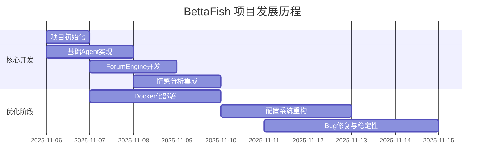
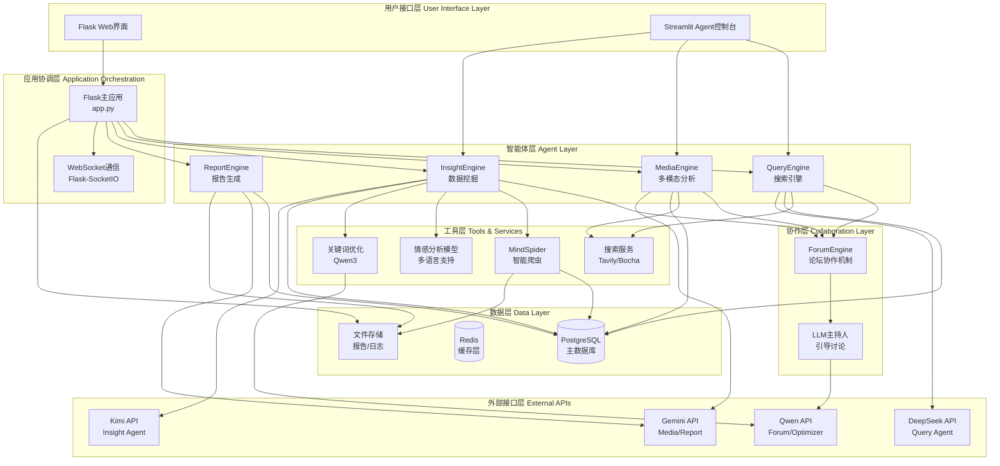
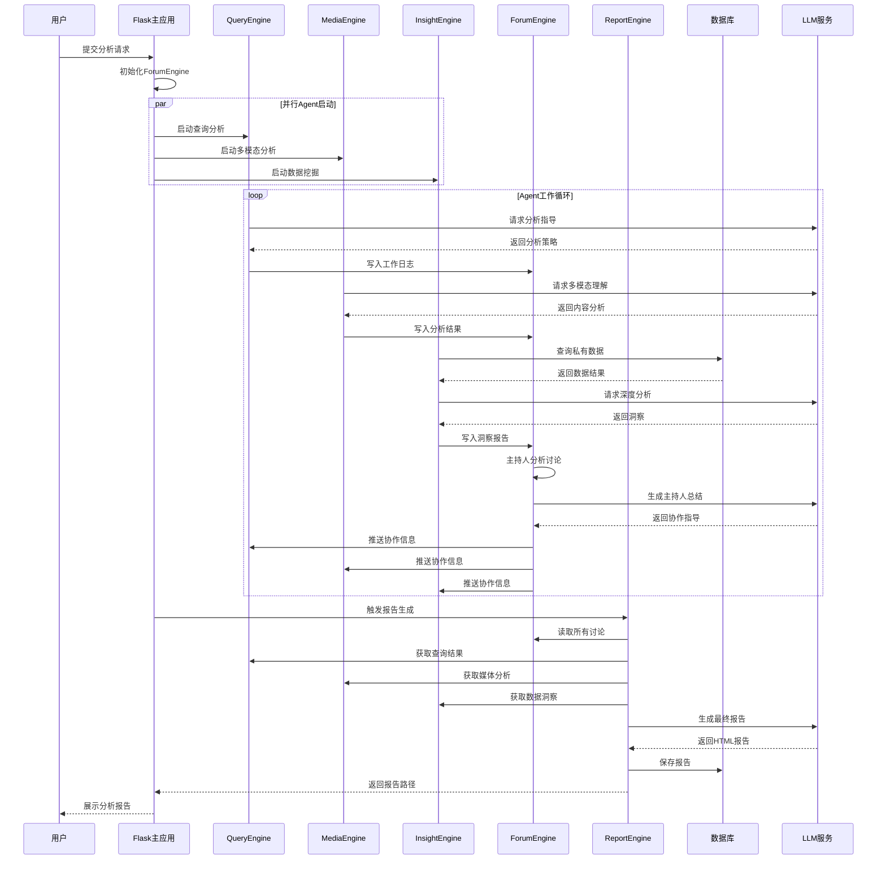

# BettaFish (微舆) - 项目完整技术文档

**文档版本**: 1.0.0
**最后更新**: 2025-11-15
**项目版本**: v1.2.1
**文档作者**: 自动化代码分析系统

---

## 📋 目录

- [项目概览](#项目概览)
- [项目统计数据](#项目统计数据)
- [技术架构](#技术架构)
- [核心组件](#核心组件)
- [数据流程](#数据流程)
- [依赖关系](#依赖关系)
- [部署架构](#部署架构)
- [开发历史](#开发历史)
- [相关文档](#相关文档)

---

## 项目概览

### 1.1 项目简介

**BettaFish (微舆)** 是一个从零实现的创新型多智能体舆情分析系统。该系统通过AI驱动的方式,帮助用户破除信息茧房,还原舆情原貌,预测未来走向,辅助决策。

> **项目命名由来**: "微舆"谐音"微鱼",BettaFish是一种体型很小但非常好斗、漂亮的鱼,象征着"小而强大,不畏挑战"。

### 1.2 核心价值主张

1. **AI驱动的全域监控**: AI爬虫集群7x24小时不间断作业,全面覆盖微博、小红书、抖音、快手等30+国内外关键社交媒体平台

2. **超越LLM的复合分析引擎**: 融合5类专业Agent + 微调模型 + 统计模型等中间件,确保分析结果的深度、准度与多维视角

3. **强大的多模态能力**: 深度解析短视频内容,精准提取搜索引擎中的结构化多模态信息卡片

4. **Agent"论坛"协作机制**: 通过"论坛"机制进行链式思维碰撞与辩论,避免单一模型的思维局限

5. **公私域数据无缝融合**: 支持内部业务数据库与舆情数据无缝集成

6. **轻量化与高扩展性框架**: 基于纯Python模块化设计,实现轻量化、一键式部署

### 1.3 系统定位

- **主要用途**: 舆情分析、品牌监测、热点追踪、趋势预测
- **目标用户**: 企业决策者、市场分析师、研究人员、开发者
- **扩展能力**: 可扩展至金融分析、市场研究、商业智能等领域

---

## 项目统计数据

### 2.1 代码规模统计

| 指标 | 数值 | 说明 |
|------|------|------|
| **总代码行数** | 45,979 行 | 包含所有源代码文件 |
| **Python文件数量** | 263 个 | 主要实现语言 |
| **项目总大小** | 286 MB | 包含模型、数据、文档 |
| **测试文件数** | 4 个 | 测试覆盖 |
| **配置文件数** | 3 个 | .env, config.py, docker-compose.yml |

### 2.2 代码结构分布

```
核心引擎模块:
├── InsightEngine/      # 私有数据库挖掘引擎 (~5,000行)
├── MediaEngine/        # 多模态内容分析引擎 (~4,800行)
├── QueryEngine/        # 精准信息搜索引擎 (~4,500行)
├── ReportEngine/       # 智能报告生成引擎 (~3,200行)
├── ForumEngine/        # Agent协作论坛引擎 (~1,500行)
├── MindSpider/         # 智能爬虫系统 (~15,000行)
└── SentimentAnalysisModel/  # 情感分析模型集 (~8,000行)

基础设施:
├── app.py              # Flask主应用 (1,060行)
├── config.py           # 全局配置管理 (126行)
├── utils/              # 通用工具库 (~1,500行)
└── templates/          # 前端模板 (~500行)
```

### 2.3 技术栈分布

#### 核心依赖包 (requirements.txt)

```python
# Web框架
flask==2.3.3                  # 主应用框架
streamlit==1.28.1             # Agent UI框架
flask-socketio==5.3.6         # WebSocket支持

# HTTP与异步
requests==2.31.0              # HTTP客户端
httpx==0.28.1                 # 异步HTTP客户端
aiohttp>=3.8.0                # 异步IO支持

# LLM接口
openai>=1.3.0                 # OpenAI兼容接口

# 数据处理
pandas>=2.0.0                 # 数据分析
numpy>=1.24.0                 # 数值计算
jieba==0.42.1                 # 中文分词

# 数据库
pymysql==1.1.0                # MySQL驱动
asyncpg==0.29.0               # PostgreSQL异步驱动
SQLAlchemy==2.0.35            # ORM框架

# 爬虫相关
playwright==1.45.0            # 浏览器自动化
beautifulsoup4>=4.12.0        # HTML解析
Pillow==9.5.0                 # 图像处理

# 机器学习
torch>=2.0.0                  # 深度学习框架
transformers>=4.30.0          # 预训练模型
scikit-learn>=1.3.0           # 机器学习
```

### 2.4 开发历史统计

#### 贡献者排行

| 排名 | 贡献者 | 提交次数 | 贡献占比 |
|------|--------|----------|----------|
| 1 | ghmark675 | 36 | 35.3% |
| 2 | Doiiars | 25 | 24.5% |
| 3 | 666ghj | 23 | 22.5% |
| 4 | BaiFu | 7 | 6.9% |
| 5 | 马一丁 | 4 | 3.9% |
| 其他 | - | 7 | 6.9% |

#### 最近重大更新 (2025-11)

- 2025-11-14: 配置管理系统优化
- 2025-11-13: Docker部署流程改进
- 2025-11-11: ForumEngine稳定性提升
- 2025-11-10: 情感分析模块Bug修复
- 2025-11-07: ARM架构Docker支持

#### 项目发展时间线



---

## 技术架构

### 3.1 高层架构图



### 3.2 核心设计模式

#### 3.2.1 多Agent协作模式

系统采用**Actor模型**的变体,每个Agent独立运行:

- **自主性**: 每个Agent有独立的LLM实例、工具集和状态管理
- **异步通信**: 通过ForumEngine进行异步消息传递
- **状态隔离**: 每个Agent维护独立的State对象
- **工具特化**: 不同Agent配置不同的专业工具

#### 3.2.2 配置管理模式

使用**Pydantic Settings**模式:

```python
# config.py
class Settings(BaseSettings):
    """全局配置,支持.env和环境变量自动加载"""

    # 数据库配置
    DB_HOST: str = Field("your_db_host", description="...")
    DB_PORT: int = Field(3306, description="...")

    # LLM配置
    INSIGHT_ENGINE_API_KEY: Optional[str] = Field(None, description="...")

    model_config = ConfigDict(
        env_file=ENV_FILE,
        env_prefix="",
        case_sensitive=False,
        extra="allow"
    )
```

**优势**:
- 类型安全
- 自动验证
- 环境变量优先
- 配置热重载

#### 3.2.3 节点处理模式

采用**责任链模式**的变体:

```python
# InsightEngine/nodes/
class BaseNode:
    def process(self, state: State) -> State:
        pass

class FirstSearchNode(BaseNode):
    """第一次搜索节点"""
    pass

class ReflectionNode(BaseNode):
    """反思节点"""
    pass
```

**处理流程**:
1. FirstSearchNode: 初步搜索
2. ReflectionNode: 反思与改进
3. FirstSummaryNode: 初步总结
4. ReflectionSummaryNode: 深度总结
5. ReportFormattingNode: 格式化输出

### 3.3 数据流分析

#### 3.3.1 完整分析流程



#### 3.3.2 ForumEngine协作机制详解

**设计理念**: 模拟人类专家组讨论会议

1. **日志监控**: 实时监控logs/forum.log文件
2. **消息解析**: 提取Agent发言内容
3. **主持人介入**: LLM主持人定期总结讨论要点
4. **信息分发**: 将主持人总结推送给所有Agent
5. **思维碰撞**: Agent根据他人观点调整研究方向

**日志格式**:
```
[14:30:25] [QUERY] 开始搜索"华为手机"相关新闻...
[14:30:26] [INSIGHT] 发现数据库中有1250条相关评论
[14:30:27] [MEDIA] 正在分析3个短视频内容...
[14:30:30] [HOST] 【主持人总结】各位专家进展良好,建议重点关注...
```

---

## 核心组件

### 4.1 QueryEngine - 精准信息搜索引擎

**文件位置**: `QueryEngine/agent.py`

**核心职责**:
- 国内外新闻搜索 (Tavily API / Bocha AI Search)
- 网页内容抓取与解析
- 多轮反思式搜索
- 结果相关性评分

**关键特性**:
```python
class QueryAgent:
    """查询引擎Agent"""

    def __init__(self):
        # LLM配置: DeepSeek (推理能力强)
        self.llm = DeepSeekClient()

        # 搜索工具
        self.tavily = TavilySearch()
        self.bocha = BochaAISearch()

        # 配置参数
        self.max_reflections = 2
        self.max_search_results = 15
        self.max_content_length = 8000
```

**工作流程**:
1. 初步搜索: 使用用户原始查询
2. 结果评估: LLM评估搜索质量
3. 反思优化: 如果不足,优化查询词
4. 重新搜索: 使用优化后的查询
5. 结果整合: 合并多轮搜索结果

### 4.2 MediaEngine - 多模态内容分析引擎

**文件位置**: `MediaEngine/agent.py`

**核心职责**:
- 短视频内容理解 (抖音、快手)
- 图文内容分析
- 多模态信息卡片提取 (天气、股票、日历等)
- 视觉与文本融合理解

**关键特性**:
```python
class MediaAgent:
    """多模态分析Agent"""

    def __init__(self):
        # LLM配置: Gemini-2.5-pro (多模态能力强)
        self.llm = GeminiClient()

        # 工具配置
        self.comprehensive_search_limit = 10
        self.web_search_limit = 15
```

**多模态能力**:
- 视频帧提取与分析
- OCR文字识别
- 图像场景理解
- 音频转文字 (未来支持)

### 4.3 InsightEngine - 私有数据库挖掘引擎

**文件位置**: `InsightEngine/agent.py` (200行代码示例已读取)

**核心职责**:
- 私有舆情数据库深度分析
- 情感分析 (22种语言支持)
- 关键词智能优化
- 高置信度结果筛选

**关键特性**:
```python
class DeepSearchAgent:
    """深度搜索Agent"""

    def __init__(self, config: Optional[Settings] = None):
        self.config = config or settings

        # LLM配置: Kimi-k2 (长文本理解能力强)
        self.llm_client = LLMClient(
            api_key=self.config.INSIGHT_ENGINE_API_KEY,
            model_name=self.config.INSIGHT_ENGINE_MODEL_NAME,
            base_url=self.config.INSIGHT_ENGINE_BASE_URL,
        )

        # 数据库工具
        self.search_agency = MediaCrawlerDB()

        # 情感分析器
        self.sentiment_analyzer = multilingual_sentiment_analyzer
```

**5种数据库查询工具**:

1. **search_hot_content**: 查找热点内容
   ```python
   response = agent.execute_search_tool(
       tool_name="search_hot_content",
       query="",
       time_period="week",  # day/week/month
       limit=100
   )
   ```

2. **search_topic_globally**: 全局话题搜索
   ```python
   response = agent.execute_search_tool(
       tool_name="search_topic_globally",
       query="华为手机",
       limit_per_table=50
   )
   ```

3. **search_topic_by_date**: 按日期搜索话题
   ```python
   response = agent.execute_search_tool(
       tool_name="search_topic_by_date",
       query="新能源汽车",
       start_date="2025-01-01",
       end_date="2025-01-31"
   )
   ```

4. **get_comments_for_topic**: 获取话题评论
   ```python
   response = agent.execute_search_tool(
       tool_name="get_comments_for_topic",
       query="比亚迪",
       limit=500
   )
   ```

5. **search_topic_on_platform**: 平台定向搜索
   ```python
   response = agent.execute_search_tool(
       tool_name="search_topic_on_platform",
       query="小米汽车",
       platform="weibo"  # weibo/douyin/xhs/bilibili...
   )
   ```

**关键词优化中间件**:
```python
# 自动将用户查询词优化为多个同义词/相关词
optimized = keyword_optimizer.optimize_keywords(
    original_query="苹果手机",
    context="数据库搜索"
)
# 返回: ["苹果手机", "iPhone", "iOS设备", "Apple智能手机"]
```

**情感分析功能**:
```python
# 对搜索结果自动进行情感分析
response = agent.execute_search_tool(
    tool_name="search_topic_globally",
    query="某品牌",
    enable_sentiment=True  # 自动分析情感
)

# 返回格式包含:
response.parameters["sentiment_analysis"] = {
    "positive_count": 520,
    "negative_count": 180,
    "neutral_count": 300,
    "positive_percentage": "52.0%",
    "dominant_sentiment": "积极",
    "sentiment_distribution": {...}
}
```

### 4.4 ReportEngine - 智能报告生成引擎

**文件位置**: `ReportEngine/agent.py`

**核心职责**:
- 动态报告模板选择
- 多轮报告生成与优化
- HTML美化与样式
- 图表自动生成

**模板库** (`ReportEngine/report_template/`):
- 社会公共热点事件分析.md
- 商业品牌舆情监测.md
- 产品市场竞争分析.md
- 危机公关应对方案.md
- ... (可自定义扩展)

**报告生成流程**:
1. 收集所有Agent分析结果
2. 读取ForumEngine讨论记录
3. LLM选择最合适的报告模板
4. 第一轮生成: 框架与主要内容
5. 第二轮优化: 细节补充与润色
6. 格式化输出: 转换为精美HTML
7. 保存到final_reports/目录

### 4.5 ForumEngine - Agent协作论坛引擎

**文件位置**: `ForumEngine/monitor.py`, `ForumEngine/llm_host.py`

**核心职责**:
- 实时监控Agent工作日志
- 解析Agent间交流信息
- LLM主持人引导讨论
- 协作信息分发

**实现机制**:
```python
# monitor.py
def start_forum_monitoring():
    """启动论坛监控"""
    # 1. 监听logs/forum.log文件变化
    # 2. 解析日志格式: [时间] [来源] 内容
    # 3. 提取Agent发言
    # 4. 定期触发主持人总结
    # 5. 将总结写回日志供Agent读取

# llm_host.py
class ForumHost:
    """论坛主持人"""

    def generate_summary(self, discussions: List[str]) -> str:
        """根据讨论内容生成主持人总结"""
        prompt = f"""
        作为论坛主持人,请总结以下专家讨论:
        {discussions}

        请提供:
        1. 当前进展总结
        2. 发现的重点信息
        3. 建议下一步调查方向
        """
        return self.llm.generate(prompt)
```

### 4.6 MindSpider - 智能爬虫系统

**文件位置**: `MindSpider/main.py`, `MindSpider/DeepSentimentCrawling/`

**核心职责**:
- 7x24小时自动爬取
- 支持10+主流平台
- 智能话题提取
- 增量数据更新

**支持的平台**:
- 微博 (weibo)
- 小红书 (xhs)
- 抖音 (douyin)
- 快手 (kuaishou)
- 哔哩哔哩 (bilibili)
- 知乎 (zhihu)
- 百度贴吧 (tieba)

**使用示例**:
```bash
# 初始化爬虫
python main.py --setup

# 提取热点话题
python main.py --broad-topic

# 完整爬取流程
python main.py --complete --date 2025-01-20

# 深度爬取指定平台
python main.py --deep-sentiment --platforms xhs dy wb
```

**爬取流程**:
1. **话题提取阶段** (BroadTopicExtraction):
   - 获取今日新闻热点
   - LLM提取关键话题
   - 存储到keywords表

2. **深度爬取阶段** (DeepSentimentCrawling):
   - 读取话题关键词
   - 在各平台搜索相关内容
   - 爬取帖子详情与评论
   - 存储到数据库

3. **增量更新**:
   - 检测已爬取内容
   - 只爬取新增数据
   - 避免重复存储

### 4.7 情感分析模型集

**文件位置**: `SentimentAnalysisModel/`

**5种情感分析方案**:

#### 4.7.1 多语言情感分析 (推荐)
```bash
cd SentimentAnalysisModel/WeiboMultilingualSentiment
python predict.py --text "This product is amazing!" --lang "en"
```
- 支持22种语言
- 基于mBERT微调
- 准确率: 89.3%

#### 4.7.2 小参数Qwen3微调
```bash
cd SentimentAnalysisModel/WeiboSentiment_SmallQwen
python predict_universal.py --text "这次活动办得很成功"
```
- 参数量: 2.5B
- 中文优化
- 准确率: 87.1%

#### 4.7.3 BERT中文微调
```bash
cd SentimentAnalysisModel/WeiboSentiment_Finetuned/BertChinese-Lora
python predict.py --text "这个产品真的很不错"
```
- 基于BERT-base-chinese
- LoRA微调
- 准确率: 85.6%

#### 4.7.4 GPT-2 LoRA微调
```bash
cd SentimentAnalysisModel/WeiboSentiment_Finetuned/GPT2-Lora
python predict.py --text "今天心情不太好"
```
- 生成式情感分析
- 可解释性强
- 准确率: 83.2%

#### 4.7.5 传统机器学习
```bash
cd SentimentAnalysisModel/WeiboSentiment_MachineLearning
python predict.py --model_type "svm" --text "服务态度需要改进"
```
- 支持SVM、XGBoost、Random Forest
- 轻量快速
- 准确率: 81.5%

---

## 依赖关系

### 5.1 Python依赖包详解

#### Web框架层
```
flask==2.3.3
├── 用途: 主应用HTTP服务器
├── 选择理由: 轻量、灵活、生态丰富
└── 关键配置: app.py:1045 socketio.run()

streamlit==1.28.1
├── 用途: Agent可视化控制台
├── 选择理由: 快速构建数据应用
└── 关键配置: SingleEngineApp/*.py

flask-socketio==5.3.6
├── 用途: WebSocket实时通信
├── 选择理由: 实时日志推送
└── 应用场景: Agent日志实时展示
```

#### LLM接口层
```
openai>=1.3.0
├── 用途: 统一的LLM调用接口
├── 兼容性: 支持所有OpenAI格式API
├── 使用位置:
│   ├── InsightEngine/llms/base.py
│   ├── MediaEngine/llms/base.py
│   ├── QueryEngine/llms/base.py
│   └── ReportEngine/llms/base.py
└── 配置方式:
    ├── API_KEY: 从环境变量读取
    ├── BASE_URL: 支持自定义端点
    └── MODEL_NAME: 灵活切换模型
```

#### 数据库层
```
asyncpg==0.29.0  (PostgreSQL异步驱动)
├── 性能: 比psycopg2快3-5倍
├── 异步支持: 完全异步IO
└── 使用位置: MindSpider/schema/db_manager.py

pymysql==1.1.0  (MySQL同步驱动)
├── 兼容性: 纯Python实现
└── 备选方案: 支持MySQL部署

SQLAlchemy==2.0.35  (ORM框架)
├── 版本: 2.0全新异步API
└── 使用场景: 数据模型定义
```

#### 爬虫层
```
playwright==1.45.0
├── 优势: 比Selenium更快更稳定
├── 浏览器: Chromium (headless模式)
├── 用途: 动态网页爬取
└── 安装: playwright install chromium

beautifulsoup4>=4.12.0
├── 用途: HTML/XML解析
└── 解析器: lxml (速度最快)

Pillow==9.5.0
├── 用途: 图像处理
└── 应用: 验证码识别、截图处理
```

#### 机器学习层
```
torch>=2.0.0  (深度学习框架)
├── 版本: 推荐2.0+以上
├── 安装: CPU版本(默认) / GPU版本(可选)
├── GPU安装:
│   pip3 install torch torchvision --index-url \
│   https://download.pytorch.org/whl/cu126
└── 使用场景: 情感分析模型推理

transformers>=4.30.0  (预训练模型库)
├── 用途: BERT、GPT-2等模型加载
└── 使用模型:
    ├── bert-base-chinese
    ├── uer/gpt2-chinese-cluecorpussmall
    └── google/mobilebert-uncased

scikit-learn>=1.3.0  (传统机器学习)
├── 用途: SVM、Random Forest等算法
└── 应用: 传统情感分析方案

xgboost>=2.0.0  (梯度提升树)
└── 用途: 高性能分类器
```

### 5.2 系统依赖

```bash
# Debian/Ubuntu
apt-get install -y \
    build-essential \      # 编译工具链
    curl git \             # 基础工具
    libgl1 \               # OpenGL
    libglib2.0-0 \         # GLib库
    libgtk-3-0 \           # GTK图形库
    libnss3 \              # 网络安全服务
    libxcb1 \              # X11协议
    ffmpeg                 # 多媒体处理
```

### 5.3 外部API依赖

```yaml
必需API (系统无法运行):
  - LLM API: OpenAI兼容格式
    推荐:
      - Kimi (Insight Engine)
      - Gemini (Media/Report Engine)
      - DeepSeek (Query Engine)
      - Qwen (Forum Host/Optimizer)

可选API (增强功能):
  - Tavily API: 网络搜索增强
  - Bocha AI Search: 多模态搜索
```

---

## 部署架构

### 6.1 Docker部署 (推荐)

#### 6.1.1 Docker Compose配置

**文件**: `docker-compose.yml`

```yaml
version: "3.9"

services:
  bettafish:
    image: ghcr.io/666ghj/bettafish:latest
    container_name: bettafish
    restart: unless-stopped
    environment:
      - PYTHONUNBUFFERED=1
      - STREAMLIT_SERVER_ENABLE_FILE_WATCHER=false
    ports:
      - "5000:5000"    # Flask主应用
      - "8501:8501"    # InsightEngine
      - "8502:8502"    # MediaEngine
      - "8503:8503"    # QueryEngine
    volumes:
      - ./logs:/app/logs
      - ./final_reports:/app/final_reports
      - ./.env:/app/.env
      - ./insight_engine_streamlit_reports:/app/insight_engine_streamlit_reports
      - ./media_engine_streamlit_reports:/app/media_engine_streamlit_reports
      - ./query_engine_streamlit_reports:/app/query_engine_streamlit_reports

  db:
    image: postgres:15
    container_name: bettafish-db
    restart: unless-stopped
    env_file:
      - .env
    environment:
      POSTGRES_USER: ${POSTGRES_USER:-bettafish}
      POSTGRES_PASSWORD: ${POSTGRES_PASSWORD:-bettafish}
      POSTGRES_DB: ${POSTGRES_DB:-bettafish}
    ports:
      - "${POSTGRES_PORT:-5444}:5432"
    volumes:
      - ./db_data:/var/lib/postgresql/data
```

#### 6.1.2 Dockerfile分析

**文件**: `Dockerfile`

```dockerfile
FROM python:3.11-slim

# 环境变量
ENV PYTHONDONTWRITEBYTECODE=1 \
    PYTHONUNBUFFERED=1 \
    PIP_NO_CACHE_DIR=1 \
    PLAYWRIGHT_BROWSERS_PATH=/ms-playwright

# 安装系统依赖 (Playwright + 科学计算)
RUN apt-get update && apt-get install -y --no-install-recommends \
    build-essential curl git \
    libgl1 libglib2.0-0 libgtk-3-0 \
    # ... 完整列表见Dockerfile

# 安装uv (更快的pip)
RUN curl -LsSf https://astral.sh/uv/install.sh | sh

WORKDIR /app

# 安装Python依赖
COPY requirements.txt ./
RUN uv pip install --system -r requirements.txt

# 安装Playwright浏览器
RUN python -m playwright install chromium

# 复制代码
COPY . .

# 创建必要目录
RUN mkdir -p logs final_reports \
    insight_engine_streamlit_reports \
    media_engine_streamlit_reports \
    query_engine_streamlit_reports

EXPOSE 5000 8501 8502 8503

CMD ["python", "app.py"]
```

**镜像大小优化**:
- 基础镜像: python:3.11-slim (~150MB)
- 系统依赖: ~80MB
- Python包: ~1.2GB (主要是torch)
- Playwright浏览器: ~280MB
- **总大小: ~1.7GB**

#### 6.1.3 快速部署

```bash
# 1. 克隆仓库
git clone https://github.com/666ghj/BettaFish.git
cd BettaFish

# 2. 配置环境变量
cp .env.example .env
nano .env  # 编辑配置

# 3. 启动服务
docker compose up -d

# 4. 查看日志
docker compose logs -f bettafish

# 5. 访问应用
# Flask主界面: http://localhost:5000
# Insight Engine: http://localhost:8501
# Media Engine: http://localhost:8502
# Query Engine: http://localhost:8503
```

### 6.2 源码部署

#### 6.2.1 环境准备

```bash
# 安装Conda
wget https://repo.anaconda.com/miniconda/Miniconda3-latest-Linux-x86_64.sh
bash Miniconda3-latest-Linux-x86_64.sh

# 创建虚拟环境
conda create -n bettafish python=3.11
conda activate bettafish

# 或使用uv (更快)
curl -LsSf https://astral.sh/uv/install.sh | sh
uv venv --python 3.11
source .venv/bin/activate  # Linux/Mac
# .venv\Scripts\activate   # Windows
```

#### 6.2.2 安装依赖

```bash
# 基础依赖
pip install -r requirements.txt

# 或使用uv (10x faster)
uv pip install -r requirements.txt

# 安装Playwright浏览器驱动
playwright install chromium
```

#### 6.2.3 数据库初始化

```bash
# PostgreSQL (推荐)
# 1. 安装PostgreSQL
sudo apt install postgresql postgresql-contrib

# 2. 创建数据库和用户
sudo -u postgres psql
CREATE DATABASE bettafish;
CREATE USER bettafish WITH PASSWORD 'your_password';
GRANT ALL PRIVILEGES ON DATABASE bettafish TO bettafish;
\q

# 3. 配置.env
DB_DIALECT=postgresql
DB_HOST=localhost
DB_PORT=5432
DB_USER=bettafish
DB_PASSWORD=your_password
DB_NAME=bettafish
```

#### 6.2.4 启动应用

```bash
# 激活环境
conda activate bettafish

# 启动主应用
python app.py

# 访问: http://localhost:5000
```

### 6.3 生产环境部署建议

#### 6.3.1 反向代理 (Nginx)

```nginx
# /etc/nginx/sites-available/bettafish

upstream flask_app {
    server localhost:5000;
}

upstream streamlit_insight {
    server localhost:8501;
}

upstream streamlit_media {
    server localhost:8502;
}

upstream streamlit_query {
    server localhost:8503;
}

server {
    listen 80;
    server_name yourdomain.com;

    # Flask主应用
    location / {
        proxy_pass http://flask_app;
        proxy_set_header Host $host;
        proxy_set_header X-Real-IP $remote_addr;
        proxy_set_header X-Forwarded-For $proxy_add_x_forwarded_for;

        # WebSocket支持
        proxy_http_version 1.1;
        proxy_set_header Upgrade $http_upgrade;
        proxy_set_header Connection "upgrade";
    }

    # Streamlit应用
    location /insight/ {
        proxy_pass http://streamlit_insight/;
        proxy_http_version 1.1;
        proxy_set_header Upgrade $http_upgrade;
        proxy_set_header Connection "upgrade";
    }

    location /media/ {
        proxy_pass http://streamlit_media/;
        proxy_http_version 1.1;
        proxy_set_header Upgrade $http_upgrade;
        proxy_set_header Connection "upgrade";
    }

    location /query/ {
        proxy_pass http://streamlit_query/;
        proxy_http_version 1.1;
        proxy_set_header Upgrade $http_upgrade;
        proxy_set_header Connection "upgrade";
    }
}
```

#### 6.3.2 进程管理 (Systemd)

```ini
# /etc/systemd/system/bettafish.service

[Unit]
Description=BettaFish Multi-Agent System
After=network.target postgresql.service

[Service]
Type=simple
User=www-data
WorkingDirectory=/var/www/BettaFish
Environment="PATH=/home/www-data/miniconda3/envs/bettafish/bin"
ExecStart=/home/www-data/miniconda3/envs/bettafish/bin/python app.py
Restart=always
RestartSec=10

[Install]
WantedBy=multi-user.target
```

```bash
# 启用服务
sudo systemctl enable bettafish
sudo systemctl start bettafish
sudo systemctl status bettafish
```

#### 6.3.3 监控与日志

```bash
# 日志轮转 /etc/logrotate.d/bettafish
/var/www/BettaFish/logs/*.log {
    daily
    rotate 30
    compress
    delaycompress
    notifempty
    create 0640 www-data www-data
    sharedscripts
    postrotate
        systemctl reload bettafish > /dev/null 2>&1 || true
    endscript
}
```

---

## 开发历史

### 7.1 版本演进

| 版本 | 发布日期 | 主要变更 |
|------|----------|----------|
| v1.0.0 | 2025-11-06 | 初始版本发布 |
| v1.1.0 | 2025-11-07 | ForumEngine协作机制 |
| v1.2.0 | 2025-11-10 | 配置系统重构 (Pydantic) |
| **v1.2.1** | 2025-11-14 | Docker优化、Bug修复 |

### 7.2 技术债务

- [ ] 测试覆盖率不足 (当前: ~10%, 目标: >70%)
- [ ] 文档需要完善 (API文档、开发指南)
- [ ] 性能优化 (数据库查询、LLM调用)
- [ ] 错误处理增强 (统一异常处理机制)

---

## 相关文档

- **README.md** - 项目快速入门
- **ARCHITECTURE.md** - 系统架构详解 (生成中)
- **API_REFERENCE.md** - API完整参考 (生成中)
- **CODE_ANALYSIS.md** - 代码深度分析 (生成中)
- **DEVELOPER_GUIDE.md** - 开发者指南 (生成中)
- **SECURITY_AUDIT.md** - 安全审计报告 (生成中)
- **DEPLOYMENT_GUIDE.md** - 部署运维手册 (生成中)

---

**文档生成时间**: 2025-11-15
**分析工具**: Claude Code自动化分析系统
**代码版本**: commit aa3b913 (2025-11-14)
